# Front matter, cover and contents

*Source PDF pages 1–7.*

## Figures

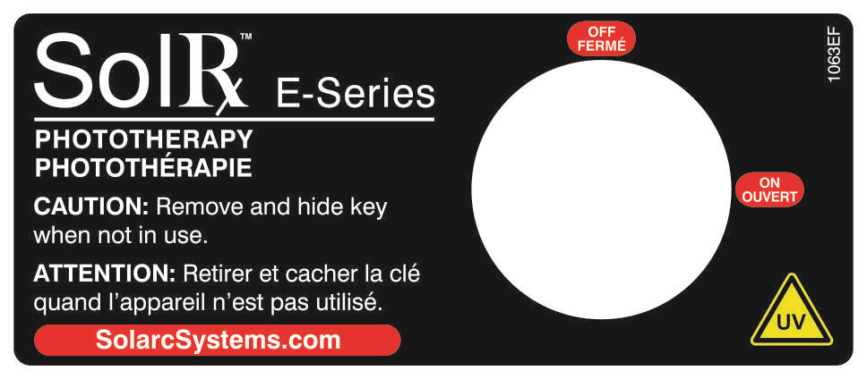
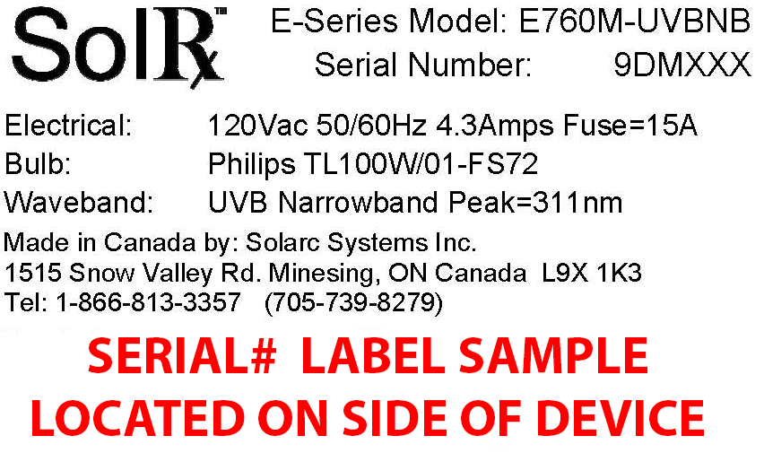
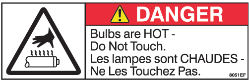
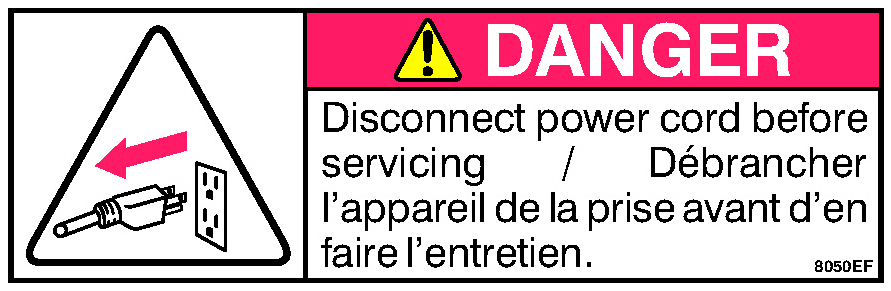
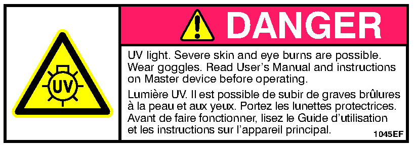
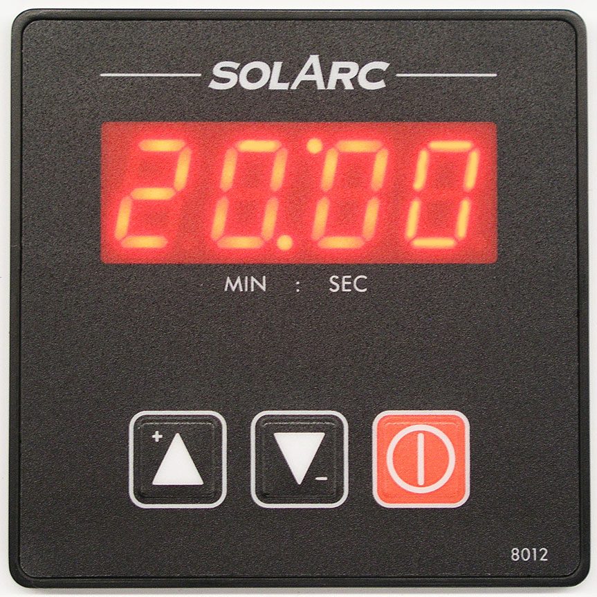
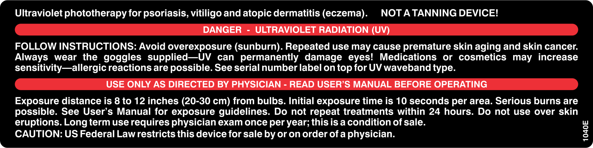
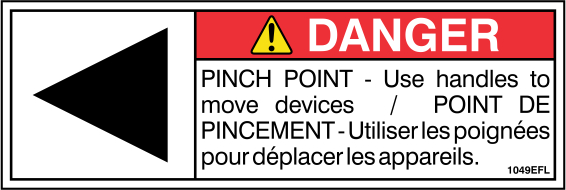
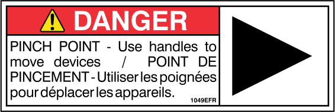
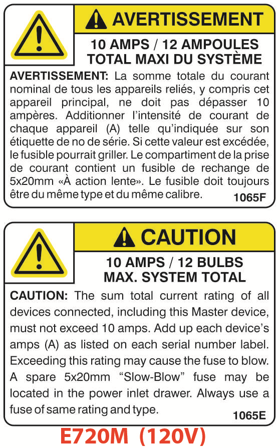
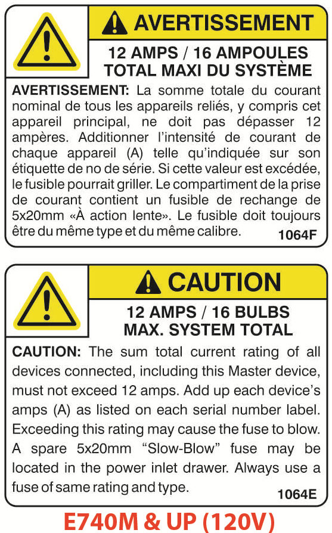
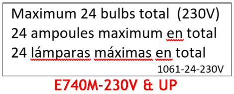
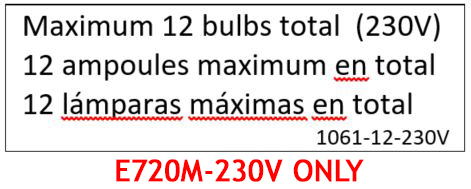

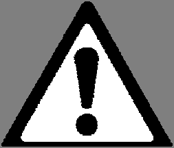

---

<!-- PDF page 1 -->
                 E-Series Expandable Ultraviolet
                   Phototherapy Lamp Unit(s)
          For the treatment of psoriasis, vitiligo, atopic dermatitis (eczema)

                         USER’S MANUAL
                 UVB-Narrowband Models:
                E720, E740, E760, E780, E790
                and their various Multidirectional (MD) configurations

                            Solarc Systems Inc.
     1515 Snow Valley Road, Minesing, Ontario L9X 1K3 CANADA
    Toll Free Phone: 866-813-3357 (705-739-8279) Fax: 705-739-9684
     Email: info@solarcsystems.com        Web: SolarcSystems.com

            WARNING: Read and understand this User's Manual in its entirety before
            using the equipment. If you have questions, consult your physician or call
            Solarc Systems toll free: 866-813-3357 (705-739-8279).

             WARNING: Use of this equipment must be accompanied by physician
             examination (skin check) at least once per year; this is a condition of sale.

            CAUTION: US Federal law restricts this equipment to sale by or on the order
            of a physician. This equipment is to be used only by the person to whom it
            is prescribed.

                 Ce manuel d'utilisation est également disponible en français.
                 Este Manual del Usuario también está disponible en español.

©Solarc Systems Inc. May-2026

        Solarc E-Series UVBNB Phototherapy System UNIVERSAL User’s Manual Rev 3.3A

<!-- PDF page 2 -->

<!-- PDF page 3 -->
  SPECIFICATIONS TABLE 1
EXPANDABLE            E720M-UVBNB MASTER & E720A-UVBNB ADD-ON (2 bulbs per device)
E-Series Models:      E740M-UVBNB MASTER & E740A-UVBNB ADD-ON (4 bulbs per device)
(Types M, A, & C)     E760M-UVBNB MASTER & E760A-UVBNB ADD-ON (6 bulbs per device)
                      E780M-UVBNB MASTER & E780A-UVBNB ADD-ON (8 bulbs per device)
                      E790M-UVBNB MASTER & E790A-UVBNB ADD-ON (10 bulbs per device)
                      Supply Voltage Options:       120V=120Vac (default; if not specified in model#),
                                                    230V=208-240Vac
                      E740C-UVBNB-230V CLINICAL MASTER (4 bulbs per device, 208-240V
                      only). See the "E-Series E740-HEX FULL BOOTH WITH BASEPLATE Assembly
                      Instructions User's Manual Supplement" for more information.
Optional Features     CAW = Clear Acrylic Window in front of the bulbs, used in lieu of Wire Guards.
                      PF = Patient Fan with switch. Available in ADD-ON devices only.
Waveband              UVB-Narrowband (Strong 311nm peak - See spectral graph that follows)
                      WARNING: STRONG SKIN-BURNING POTENTIAL
                      Initial treatment times are only seconds long!
Bulb Part#            Philips “TL100W/01-FS72” (6-foot, T12, Recessed Double Contact ends)
Ballast Part#         Universal Lighting Technologies (ULT) "B295PUNVHE"
Voltage Rating 120 Volts AC ▼                                       208-240 Volts AC "-230V" ▼
Electrical         Dedicated 120V single-phase circuit              Dedicated 208-240V single-phase circuit
Requirements       15-Amp 1-pole circuit breaker, 50/60Hz           15-Amp 2-pole circuit breaker, 50/60Hz
Compatible Devices Any E-Series device that does NOT                Any E-Series device that has "-230V" in
                   have "-230V" in the model#.                      the model#.
                   Earlier E720 "Mark1" devices did not             Earlier E720 "Mark1" devices did not have
                   have the CAW or PF options.                      the CAW or PF options.
Fuse(s):           E720M: Qty one (1) 5x20mm, 10-Amp                ALL 208-240V Master Devices:
(Located on top of Slow-Blow/Low-Breaking; such as
the Master Device) Littelfuse part number “0218010”.                Qty two (2) 5x20mm, 10-Amp Slow-
                                                                    Blow/Low-Breaking; such as Littelfuse
                      E740M & UP: Qty one (1) 5x20mm, 15-           part number “0218010”.
                      Amp Slow-Blow/Low-Breaking; such
                      as Littelfuse part number “'0218015”.
Regulatory Info       Designed & manufactured in Canada by Solarc Systems Inc. (Founded Nov-1992)
                      ISO-13485:2016 / MDSAP Certified by Intertek Testing Services
                      MDSAP Facility Identifier F000961, DUNS# 256728031
                      Health Canada:
                      Medical Device Licence# 12783 (Class-2), Company ID# 116764, MDEL# 3433
                      US-FDA:
                      E-Series 510(k)# K103204 (Class-2), E-Series Device Listing# D136898, Facility
                      Registration# 3004193926, Owner/Operator# 9014654
                      For sale only by or on order of a physician per 21CFR801.109 Prescription Devices
Tax Credit            All SolRx phototherapy devices and their replacement bulbs are eligible for the Medical
(Canada)              Expense Tax Credit (METC) on your Canadian income taxes.
Insurance Codes       HCPCS Code = E0693 "Panel", if a single E-Series device only OR
(USA)                 HCPCS Code = E0694 "Multidirectional", if two (2) or more E-Series devices.

             Solarc E-Series UVBNB Phototherapy System UNIVERSAL User’s Manual Rev 3.3A                         3

<!-- PDF page 4 -->
SPECIFICATIONS TABLE 2
E-Series Model:      E720M-UVBNB        E740M-UVBNB        E760M-UVBNB        E780M-UVBNB         E790M-UVBNB
(Add "-230V" for     E720A-UVBNB        E740A-UVBNB        E760A-UVBNB        E780A-UVBNB         E790A-UVBNB
208-240V models)                        E740C-UVBNB
Frame Size           Small              Medium             Medium             Large               Large
Number of Bulbs      2                  4                  6                  8                   10
per Device
Maximum              12@120V            16@120V            16@120V            16@120V             16@120V
allowable total      12@208-240V        24@208-240V        24@208-240V        24@208-240V         24@208-240V
number of BULBS
in a SYSTEM
Nominal              Based on the maximum nominal steady state Irradiance at the midpoint center of the
UVB-Narrowband       device(s) at a distance of 10” from the plane of the front surface of the bulbs. The Nominal
Irradiance           UVB Irradiance value is estimated using new bulbs burned-in for 20 minutes at ambient
(mW/cm^2)            temperature ~20°C; as taken with an International Light IL1400 ultraviolet radiometer
As used in           calibrated for UVB-Narrowband. Irradiance is NOT affected by supply voltage.
Appendix D
                     The maximum Irradiance is at the lateral and vertical center of the device(s).

1 Device             2.5 (E720M)        4.5 (E740M)        6   (E760M)        7 (E780M)           8 (E790M)
2 Devices            4   (MD22)         6.5 (MD44)         9   (MD66)
3 or more Devices    5   (MD222+)       7.5 (MD444+)       10  (MD666+)
Other Common                            MD242: 7.5         MD262: 9           MD282: 9.5          MD292: 10
Multidirectional                        SMALL-HEX
Systems                                 E740-HEX
Current (Amps) per   1.4@120V           2.8@120V        4.2@120V              5.5@120V            6.8@120V
ADD-ON Device*       0.8@208-240V       1.6@208-240V    2.4@208-240V          3.2@208-240V        4.0@208-240V
Power Supply Cord    IEC C13 to         IEC C19 to NEMA 5-15P ►
Included, 120V       NEMA 5-15P         SJT14-3
Must be Grounded!    SJT16-3            (14 gauge, 3C)
                     (16 gauge, 3C)
Power Supply Cord    IEC C13 to         IEC C19 to NEMA 6-15P ►
Included, 208-240V   NEMA 6-15P         SJT14-3
Must be Grounded!    SJT16-3            (14 gauge, 3C)
                     (16 gauge, 3C)
Device Weight        34 lbs [15.5kg]    46 lbs [20.9kg]    48 lbs [21.8kg]    62 lbs [28.2kg]     65 lbs [29.5kg]
Device               73x14x4"           73x21x4"           73x21x4"           73x28x4"            73x28x4"
Dimensions           [185x36x10cm]      [185x53x10cm]      [185x53x10cm]      [185x71x10cm]       [185x71x10cm]
Shipping Weight      48 lbs [21.8kg]    61 lbs [27.7kg]    63 lbs [28.6 kg]   78 lbs [35.5kg]     81 lbs [36.8kg]
Shipping             78x17x7"           78x25x7"           78x25x7"           78x33x7"            78x33x7"
Dimensions           [198x43x18cm]      [198x64x18cm]      [198x64x18cm]      [198x84x18cm]       [198x84x18cm]
* Add nominally 0.1 amps for the MASTER device.

     Suggested treatment times are located
       at the back of this User's Manual in
    Appendix D: Exposure Guideline Tables

4              Solarc E-Series UVBNB Phototherapy System UNIVERSAL User’s Manual Rev 3.3A

<!-- PDF page 5 -->
           CAUTION: The Nominal UVB Irradiance values are for NEW bulbs, are approximations
           only, and subject to many variables including, but not limited to: presence and
           cleanliness of a Clear Acrylic Window (CAW) in front of the bulbs, bulb usage, bulb preheat
 time, bulb operating time, ambient temperature, bulb manufacturing variance, reflector quality, and skin
 surface: (a) distance from the bulbs, (b) position relative to the bulbs, and (c) angle to the bulbs. The
 dosage times and dosage time maximums provided in the Exposure Guideline Tables are therefore
 approximations only. See Discussion in the Exposure Guideline section.
 If accurate dosage times are required, do not use the Exposure Guideline Tables provided. Instead,
 take regular UVB Irradiance readings using a calibrated light meter (not provided) and calculate the
 dosage times and dosage time maximums using the equation provided.

Note: In this User's Manual, some of the illustrations and pictures may be of other members of the
E-Series device family - devices with fewer or more bulbs than yours. The information presented is
nonetheless representative of all E-Series devices. An exception is earlier E720 2-bulb "Mark-1"
devices, manufactured until approximately the year 2023 and identified by serial numbers that start
with the number "8". These devices do not have the Clear Acrylic Window (CAW) or Patient Fan (PF)
options, but are otherwise compatible with the E-Series "Mark2" devices, which are identified by serial
numbers that start with the numbers "7" or "9".

          Solarc E-Series UVBNB Phototherapy System UNIVERSAL User’s Manual Rev 3.3A                    5

<!-- PDF page 6 -->
DEVICE
LABELS

6    Solarc E-Series UVBNB Phototherapy System UNIVERSAL User’s Manual Rev 3.3A

<!-- PDF page 7 -->
TABLE OF CONTENTS
                                                                                                                        Page No.
1.    INTRODUCTION ............................................................................................................... 8
2.    DEFINITIONS ................................................................................................................... 9
3.    PHOTOTHERAPY CONTRAINDICATIONS................................................................... 11
4.    GENERAL WARNINGS - UVB PHOTOTHERAPY ........................................................ 11
5.    EQUIPMENT SAFETY .................................................................................................... 12
6.    INSTALLATION CONSIDERATIONS ............................................................................ 13
7.    MASTER DEVICE INSTALLATION ............................................................................... 13
8.    ADD-ON DEVICE INSTALLATION ................................................................................ 16
      General Considerations .................................................................................................. 16
      Hinge Point Connection .................................................................................................. 17
      Electrical Connection ...................................................................................................... 17
9.    TREATMENT DISTANCE & MULTI-DIRECTIONAL (MD) SETUP ............................... 18
10.   LARGER SYSTEMS & FULL BOOTHS ......................................................................... 19
      SMALL-HEX Booth Installation ....................................................................................... 19
11.   OTHER FEATURES & OPTIONS .................................................................................. 21
      Patient Fan (-PF Option, for devices with wire guards only) ........................................... 21
      Clear Acrylic Window (-CAW Option) .............................................................................. 21
      Towel Hooks ................................................................................................................... 21
      Gap Seals ....................................................................................................................... 22
12.   BODY POSITIONS ......................................................................................................... 22
13.   EXPOSURE GUIDELINES ............................................................................................. 25
      General Exposure Information: ....................................................................................... 26
14.   TREATMENT PROCEDURE .......................................................................................... 29
15.   PSORIASIS LONG TERM MAINTENANCE PROGRAM ............................................... 30
16.   VITILIGO TREATMENT DISCUSSION .......................................................................... 31
17.   TRANSPORTATION ....................................................................................................... 31
18.   MAINTENANCE .............................................................................................................. 31
19.   BULB REPLACEMENT .................................................................................................. 32
20.   TROUBLESHOOTING .................................................................................................... 34
      No Device Power ............................................................................................................ 34
      Broken Bulb(s) ................................................................................................................ 34
      Some Bulbs Do Not Turn On .......................................................................................... 35
      Timer Failure ................................................................................................................... 35

APPENDIX A: Electrical Schematic(s)

APPENDIX B: What to do if a fluorescent light bulb breaks in your home

APPENDIX C: Phototherapy Calendars (To record your treatment history)

APPENDIX D: EXPOSURE GUIDELINE TABLES (Your suggested treatment times)

         Solarc E-Series UVBNB Phototherapy System UNIVERSAL User’s Manual Rev 3.3A                                                          7

