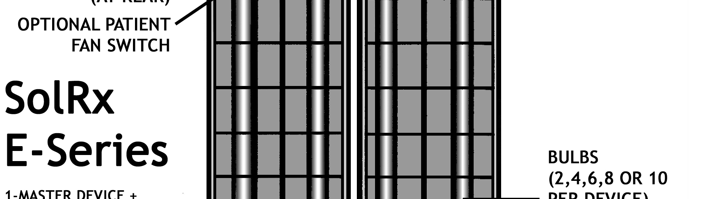
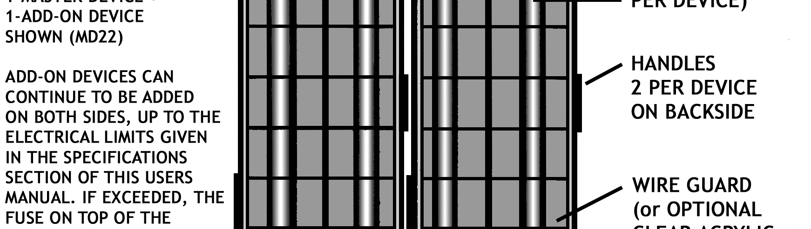
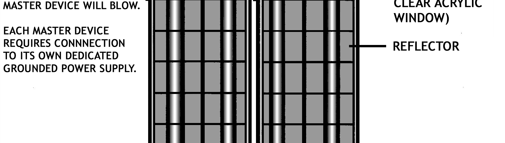
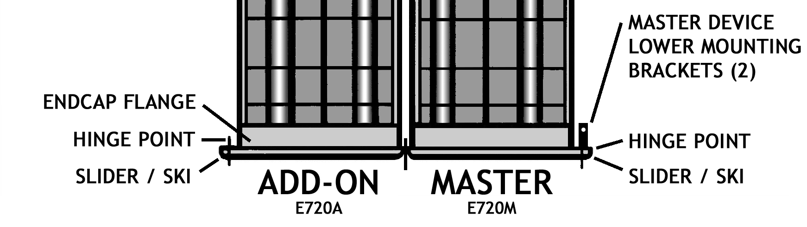
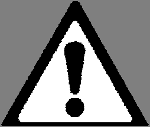

# 2. Definitions

*Source PDF pages 9–10.*

## Figures

---

<!-- PDF page 9 -->
2. DEFINITIONS
A “bulb” is a single replaceable fluorescent light tube.
A “device” is a single piece of E-Series equipment; containing 2, 4, 6, 8 or 10 bulbs.
A “system” is one or more E-Series devices used together to treat a patient.

The MASTER device (or simply the "MASTER") is the device with the timer, switchlock and power
entry components. It is always the first device needed in an E-Series system. There are two (2)
"Types" of MASTER devices, as indicated by the letter after the first 3 digits in the model#:
1. The Type "M" MASTER device, such as the E720M-UVBNB, is for home phototherapy and is the
    most common.
2. The Type "C" CLINICAL MASTER device, such as the E740C-UVBNB-230V, has additional
    special features for use in a phototherapy clinic.

The ADD-ON device (or simply the “ADD-ON”) is the device WITHOUT a timer or switchlock, such as
the E720A-UVBNB. It gets its power from and is controlled by the MASTER. Several ADD-ON
devices can be operated by a single MASTER device, up to the "Maximum allowable total number of
BULBS in a system" limits given in Specifications Table 2 above.

“Multidirectional” means that two or more devices are connected to each
other and able to be orientated at different angles to deliver UVB light in
multiple directions, which improves exposure uniformity. These systems are
identified by "MD" followed by the number of bulbs in each device as viewed
left to right, with the MASTER device implied to have the most bulbs and be in
the middle. So, for example a 6-bulb MASTER with a 2-bulb ADD-ON on each
side is a "MD262"►, with the sum of the digits being the TOTAL number of
bulbs in the system (10 in this case). In this numbering system 10-bulb devices
are denoted by a "9".

“Assembly Configurations” (or “system configurations”) are the many ways that different numbers
of E-Series devices can be assembled together and positioned.

"Irradiance" is the UVB light power received by a surface and is usually expressed in milliwatts per
square centimeter (mW/cm^2). It can be thought of as the UVB light's "intensity", or "brightness".

"Dose" is the total amount of UVB energy received by a skin surface, is usually expressed in
milliJoules per square centimeter (mJ/cm^2), and is governed by the equation:
                   Time (seconds) = Dose (mJ/cm^2) ÷ Irradiance (mW/cm^2)
This equation can be rearranged to: Dose (mJ/cm^2) = Irradiance (mW/cm^2) * Time (seconds)
A fun analogy to understand it is that "Irradiance" is how hard the snow is falling, and "Dose" is how
much snow has accumulated on the ground. (For extra fun we can think of the snow as being
photons of UVB light.)

          Solarc E-Series UVBNB Phototherapy System UNIVERSAL User’s Manual Rev 3.3A                     9

<!-- PDF page 10 -->
10   Solarc E-Series UVBNB Phototherapy System UNIVERSAL User’s Manual Rev 3.3A

