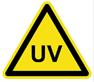

# 4. General Warnings - Uvb Phototherapy

*Source PDF pages 11–11.*

## Figures

---

<!-- PDF page 11 -->
4. GENERAL WARNINGS - UVB PHOTOTHERAPY
This information is provided for review by you and your physician:

            WARNINGS – UVB PHOTOTHERAPY

 •   Erythema – As with natural sunlight, severe sunburn is possible if the minimum erythema dose
     (MED) is exceeded. In some patients, doses less than the MED may also cause erythema.
 •   Hyperpigmentation – Some patients may experience localized skin darkening.
 •   Depigmentation – Some patients may experience localized skin whitening.
 •   Actinic Degeneration – Exposure to ultraviolet light may result in premature aging of the skin.
 •   Arsenic Therapy – Patients with a history of arsenic therapy should be diligently observed for
     signs of carcinoma.
 •   Basal Cell Carcinoma – Patients exhibiting multiple basal cell carcinoma or having a history of
     basal cell carcinoma should be diligently observed and treated.
 •   Cardiac Diseases – Patients with cardiac disease and others that cannot tolerate prolonged
     standing should not be treated with a vertical ultraviolet phototherapy system.
 •   Concomitant Therapy – Special care should be taken when treating patients who are receiving
     topical or systemic concomitant therapy with photosensitizing agents (at the same time).
 •   Radiation Therapy – Patients with a history of x-ray or grenz ray therapy should be diligently
     observed for signs of carcinoma.
 •   Total Dosage – The total long term cumulative dose of UVB that can be safely taken has not
     been established.
 •   Vitamin D Toxicity - UVB makes large amounts of Vitamin D in the skin - beware concurrently
     taking large amounts of Vitamin D tablets. Evaluate the risk by getting a 25(OH)D blood test.
 •   Aphakia - The absence of lenses in the eye increases the risk of retinal damage so great care
     must be taken to avoid exposing the eyes to UVB. It is critical to always wear the goggles!

         Solarc E-Series UVBNB Phototherapy System UNIVERSAL User’s Manual Rev 3.3A                  11

