# 8. Add-On Device Installation

*Source PDF pages 16–18.*

## Figures

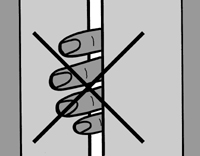
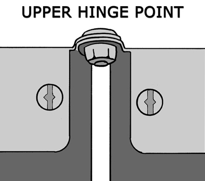
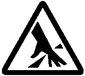
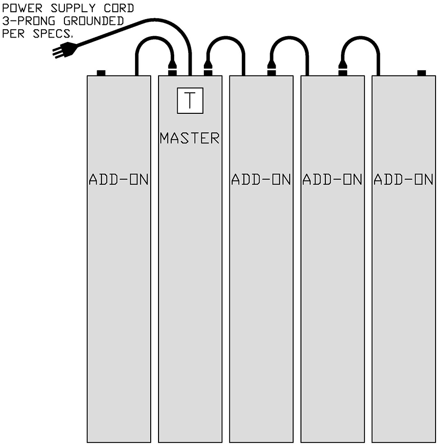

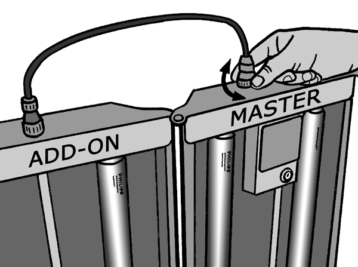

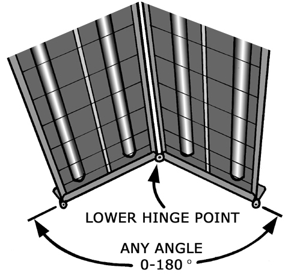

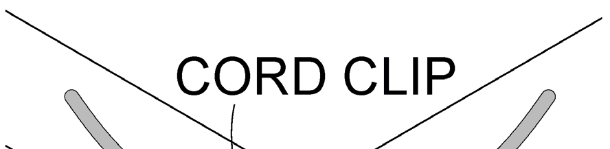
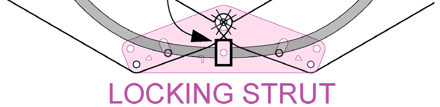

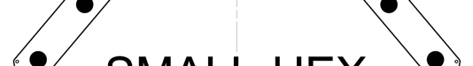
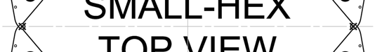
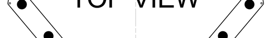

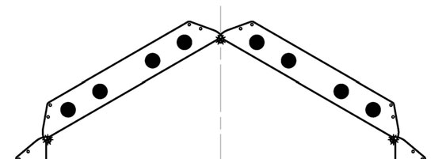
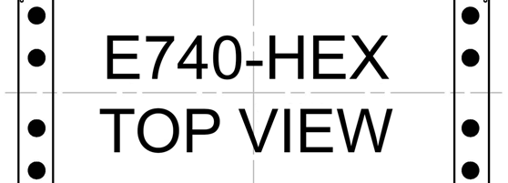

---

<!-- PDF page 16 -->
8. ADD-ON DEVICE INSTALLATION
The ADD-ON device (or simply the “ADD-ON”) is the device WITHOUT a timer or switchlock.
It gets its power from and is controlled by the MASTER. ADD-ONs cannot be operated on their own -
there must first be a MASTER device previously installed as the first device in the system.

Any number of E-Series devices can be mechanically connected at the hinge points, but the total
number of bulbs that can be electrically controlled by one MASTER is limited to the values given in
SPECIFICATIONS TABLE 2, which requires special attention paid to the system's voltage: 120vac or
208-240vac. All devices in a system must be the same voltage - errors mixing voltages can result in
equipment damage and other safety hazards.

Note: Devices designed to operate on 208-240vac supply power are denoted by addition of "-230V"
in the model#, such as E740M-UVBNB-230V; whereas devices designed to operate on 120vac
supply power do not have any voltage indicated in the model#, such as E740M-UVBNB. For typical
home phototherapy use in North America, most systems will be 120V for connection to a common
3-prong 15-amp grounded wall outlet known as 5-15P ►.

General Considerations

IMPORTANT: When adding device(s), it is important to review which Exposure Guideline Table from
Appendix D you should be using and make changes as necessary. It is suggested that your specific
Exposure Guideline Table page be removed or copied from the appendix and relocated to the first
page in this User's Manual, with any irrelevant information crossed off in pencil.

           WARNING: After installing new ADD-ON device(s), change your Exposure Guideline
           Table AND significantly reduce your treatment times! Failure to may cause severe
           skin burns.

IMPORTANT: When adding devices, beware that the newer bulbs will have more light power
(irradiance) and therefore more skin-burning potential than your existing bulbs, so treatment times
must be significantly reduced. Consider balancing the light intensity by removing and relocating some
of the new bulbs to the older device.

Note that, as devices are added to your system, your total treatment time is reduced because
the treatment area increases, and typically the irradiance also increases. Devices can continue to be
added over time to create a high performance wrap-around “booth”. ADD-ONs are less expensive
than MASTERs because ADD-ONs do not have any control system or power entry components.
Consider purchasing more ADD-ONs if your total treatment time has become too long.

Note: The bulbs in all new devices are “burned-in” at Solarc Systems. There is no need to perform the
“burn-in” procedure outlined in the “Bulb Replacement” section.

          WARNING: Respect the maximum number of devices and bulbs that may be connected
          together in a system, as indicated in SPECIFICATIONS TABLE 2, with special attention
          paid to the system's voltage: 120vac or 208-240vac. If exceeded, the fuse(s) located on the
top endcap of the MASTER device will blow. Always use a replacement fuse of the same current
rating and type (5x20mm, Slow-Blow/Low-Breaking). If the fuse blows repeatedly, call Solarc
Systems toll free 866-813-3357 (705-739-8279).

16             Solarc E-Series UVBNB Phototherapy System UNIVERSAL User’s Manual Rev 3.3A

<!-- PDF page 17 -->
Hinge Point Connection

ADD-ONs are typically not fastened to a wall; instead, they are
mechanically connected to other devices at the hinge point lugs (or
“ears”) on the outer corners of the top and bottom endcaps.

Parts supplied: (2) 1/4” machine-screws; (2) lock-nuts (“thin” type)
Tools required: 7/16” wrench; Phillips(cross+) Screwdriver (#3 with a
                 long shaft works best)

To connect two devices together at the hinge points:
1. First, ensure that all devices are the same correct supply voltage: 120vac or 208-240vac.
2. Ensure that the MASTER device’s upper and lower mounting brackets are properly fastened to
   the wall per the preceding MASTER Device Installation section.
3. Using the device handles and being careful not to put your fingers in the pinch-point gap between
   devices, move the device to be added into location beside the existing device.
4. Align the UPPER lugs of the two devices and, from the top, insert a 1/4” machine-screw so it
   points downward. If necessary, by hand slightly bend one lug up or down so the lugs can pass by
   each other - the lugs can go on either side of each other. Then hand-tighten a lock-nut onto the
   machine-screw; which is most easily done by spinning the machine-screw with the screwdriver
   while holding the nut by hand. It may be necessary to stand on a small step-ladder.
5. Align the LOWER lugs, and similarly install the other 1/4” machine-screw, again from the top so it
   points downward. Then hand-tighten a lock-nut. There is limited space under the LOWER lugs; if
   you are having difficulty getting the lock-nut to start, consider using a piece of tape to hold it in the
   wrench while turning the screwdriver.
6. Tighten both lock-nuts using the screwdriver and wrench. Later, consider fully tightening the lock-
   nuts to help hold the device locations.

            DANGER: Keep your fingers away from the pinch-point gap
            between devices. Do NOT grab the sides of the devices to move
            them - use only the handles to move devices.
            Failure to can cause fingers to be pinched.

Electrical Connection

ADD-ON devices are electrically connected in series to each
other, and the MASTER as illustrated here ►

Each ADD-ON has a permanently attached connection cable
that plugs into the receptacle on the adjacent device. The
MASTER has two (2) receptacles to accept cables from
either side. ADD-ONs have one (1) receptacle to accept a
cable from one other ADD-ON.

The timer in the MASTER controls the MASTER device plus
all of the ADD-ONs. If more ADD-ONs are connected than
allowed in SPECIFICATIONS TABLE 2, the fuse in the
MASTER will blow.

Connect the power supply cord to an adequately sized and grounded electrical receptacle of the
specified voltage. Never modify the power cord so that it will fit in a two-prong outlet.

         Solarc E-Series UVBNB Phototherapy System UNIVERSAL User’s Manual Rev 3.3A                       17

<!-- PDF page 18 -->
ADD-ONs can be connected to the MASTER in any order; for example, in a three-device setup, this is
most typically one ADD-ON on each side of the MASTER, but it could also be both ADD-ONs on the
left side of the MASTER. Just remember that one device must be fastened to the wall at the top.

To connect an ADD-ON cable: (no tools required)
1. Check that all devices are the same correct supply
   voltage: 120vac or 208-240vac.
2. Ensure that the hinges of the two devices are
   connected per the previous section.
3. Turn the MASTER device switchlock OFF and
   detach the power supply cord.
4. Un-screw the dust cover from the mating
   receptacle.
5. Place the cable fitting in close contact and vertically
   aligned with the receptacle. If the connection cable
   is too short, loosen the strain relief nut on the
   ADD-ON, pull the cord out further, and retighten the
   nut. (The cord is prevented from being pulled out
   too far and damaging the internal wiring.)
6. Rotate and gently push down on the cable fitting until it falls into place. There is only one
   rotational position that will allow the fittings to be mated together, so it could take almost a full turn
   to find its slot. Do not use excessive force; the connection should be made fairly easily.
7. Hand tighten the black plastic nut.
8. The hardware kit for each Add-On includes two plastic push-in CORD-CLIPS for use in the 1/4"
   holes on the top endcaps of the device. These clips can be used to retain the device connection
   cables as shown on page 19 (one clip on the Master top endcap and one clip on the Add-On top
   endcap).

