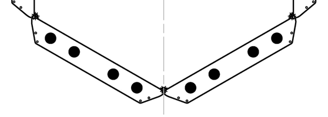
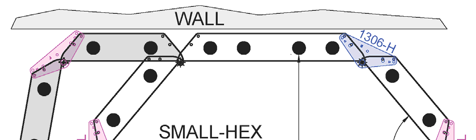
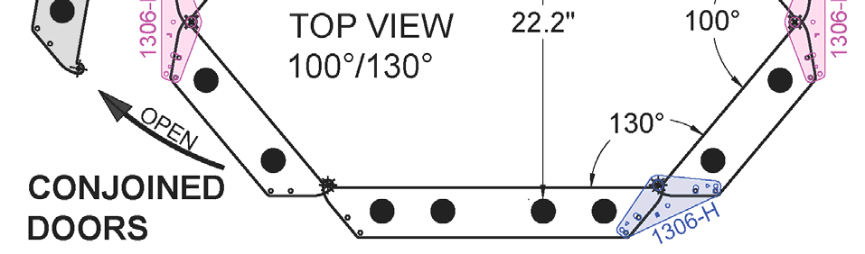
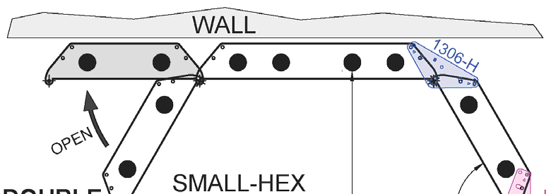
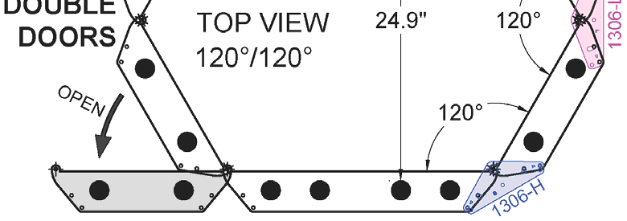
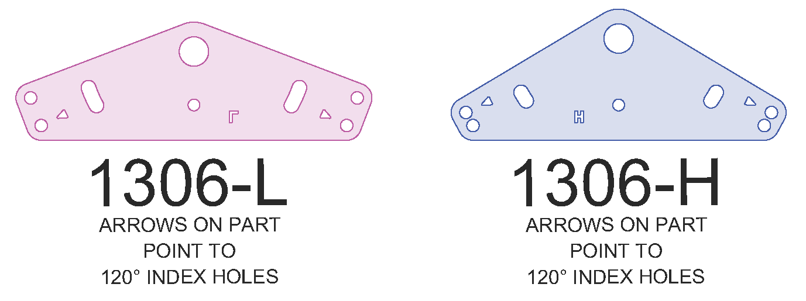
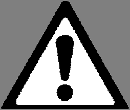

# 10. Larger Systems & Full Booths

*Source PDF pages 19–20.*

## Figures

---

<!-- PDF page 19 -->
10.    LARGER SYSTEMS & FULL BOOTHS
Any number of E-Series devices can be mechanically connected at the hinge points, but the total
number of bulbs that can be electrically controlled by one MASTER is limited to the values given in
SPECIFICATIONS TABLE 2, which requires special attention paid to the system's voltage: 120vac or
208-240vac. All devices in a system must be the same voltage - errors mixing voltages can result in
equipment damage and other safety hazards.

For example, using the E740M (4-bulb, 120Volt) MASTER device, a
system can have up to a total of 16 bulbs; such as the 4-bulb E740M
MASTER controlling a 4-bulb E740A ADD-ON and four (4) 2-bulb
E720A ADD-ON devices; to create the "SMALL-HEX" booth, which is a
compact 16-bulb, 120V full booth for home phototherapy. This booth
may be too small for larger patients.

Alternatively, using the E740M-230V (4-bulb, 208-240Volt) MASTER
device, a system can have up to a total of 24 bulbs; such as the 4-bulb
E740M-230V MASTER controlling five (5) 4-bulb E720A-230V ADD-ON
devices; to create the larger “E740-HEX” booth, which is suitable for
either home or clinical use. In this case the devices are mounted on a
heavy plastic baseplate, so the entire assembly is freestanding and
easy to move around.

Note: If an E740-HEX booth is to be used in a phototherapy clinic, a
special CLINICAL MASTER E740C-230V device is advised. It includes
a patient's emergency stop pushbutton and is available with "C01" timer
firmware that allows the clinician to set and lock the treatment time, and the patient to start/stop the
treatment but not repeat it. For more information see the "E-Series E740-HEX FULL BOOTH WITH
BASEPLATE Assembly Instructions User's Manual Supplement", and the "Solarc C01 Timer
User's Manual Supplement".

Note: The original "Mark1" design of the E-Series 2-bulb E720 phototherapy system (manufactured until
approximately the year 2023 and identified by serial numbers that start with the number "8"):
•   has MASTER devices that limit the system to 10-bulbs total if 120V, or 20-bulbs total if 208-240V,
•   draws more electrical current at 120V than "Mark2" devices - see the device's SPECIFICATIONS,
•   requires that the MASTER device switchlock key be removed to fully fold devices upon each other,
•   does not have an option for a Clear Acrylic Window or Patient Fan.
These devices are otherwise compatible with E-Series "Mark2" devices.

SMALL-HEX Booth Installation

As with smaller E-Series systems, the SMALL-HEX
booth must be prevented from falling over, which is a
risk if the system is folded up onto itself. This can be
achieved by fastening one device to a wall as
previously instructed OR by using the provided
"Locking Struts" fastened to the top endcap flanges
as shown here. These struts lock the devices in
position relative to each other so the booth is stable
and can safely stand on its own. Locking struts have
a hole for a cord clip (supplied) to hold the connection cable.

         Solarc E-Series UVBNB Phototherapy System UNIVERSAL User’s Manual Rev 3.3A                      19

<!-- PDF page 20 -->
The SMALL-HEX comes with two “H” locking struts and two “L” locking struts. Tiny arrows on the
parts point to the holes used for a 120° angle between adjacent devices. The other holes are for 100°
and 130° angles between adjacent devices. There are two possible geometric configurations as
shown below: With all interior angles set to 120° the distance between bulbs is 24.9 inches OR with
interior angles set to 100° and 130° the distance between bulbs is 22.2 inches. You may also choose
to use the SMALL-HEX without any locking struts, which allows continuous booth size changes, but
one device must be fastened to the wall at the top to stabilize the system.

The SMALL-HEX also has two door configuration options. DOUBLE DOORS require booth entry from
the short end of the booth. CONJOINED DOORS use the 1306-L Locking Strut to connect a pair of 2-
bulb devices, which makes for better booth entry geometry and only one “door” to operate. It is not
recommended to use the larger 4-bulb device as a door because it is too heavy.

           WARNING: Use of the SMALL HEX booth may result in an exposure distance less
           than the minimum 8 inches (20cm) recommended, especially for larger patients.
           Reduce treatment times and proceed cautiously. Failure to may cause skin burns.
 Alternatively, the device assembly can be opened up to form a C-shape for more space.

          DANGER: All E-Series systems must be prevented from falling over, by either
          fastening one device to a wall as directed, or in the case of full booths, using
          "Locking Struts" to lock the devices in position. Failure to may result in device(s)
          falling causing severe injury or death.

Another option to create a large full booth if only 120V power is available, is to use two (2) MASTER
devices and operate the two timers simultaneously. In this case each MASTER device must be
connected to its own dedicated 15-amp 120-volt circuit, which is usually NOT available on the same
wall duplex outlet plate, and may NOT be available from other nearby outlets if they are on the same
circuit breaker in your home or building. If necessary, consult an electrical expert.

20            Solarc E-Series UVBNB Phototherapy System UNIVERSAL User’s Manual Rev 3.3A

