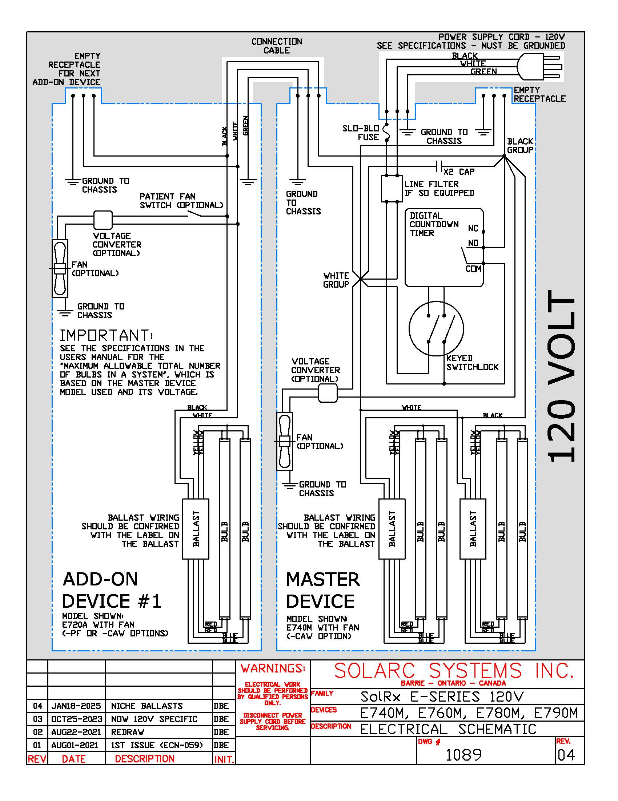
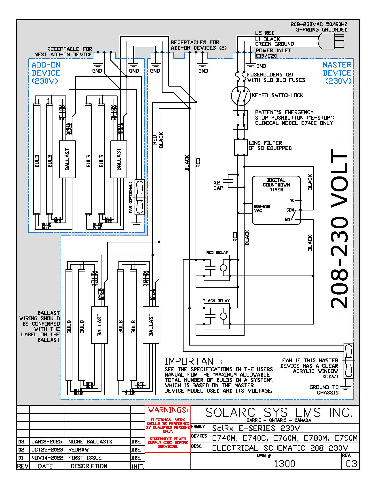
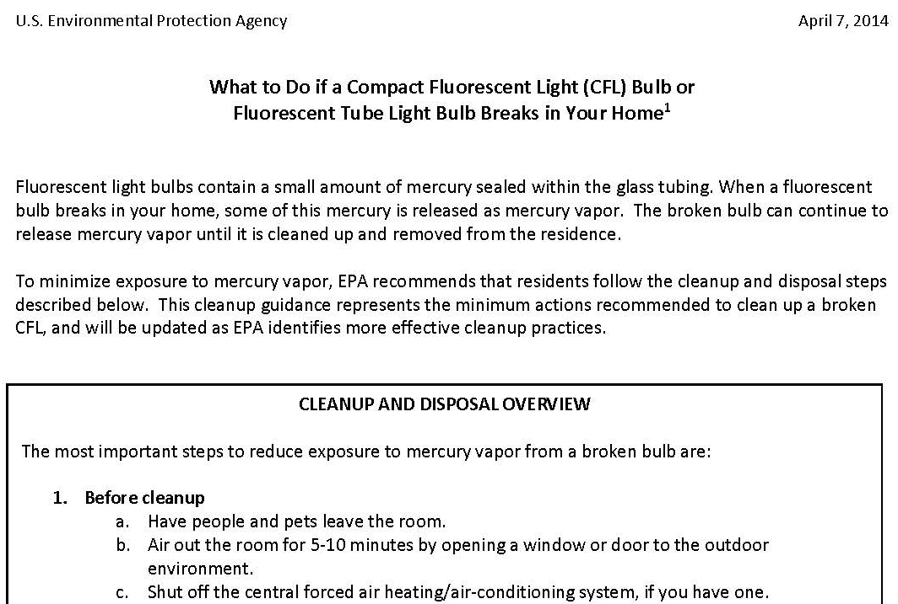
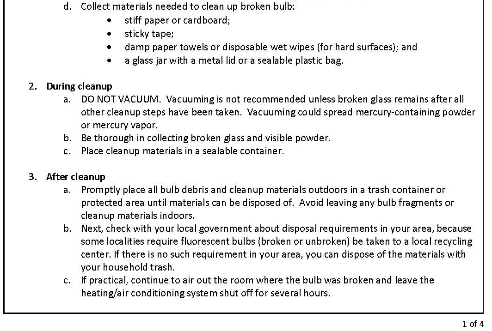
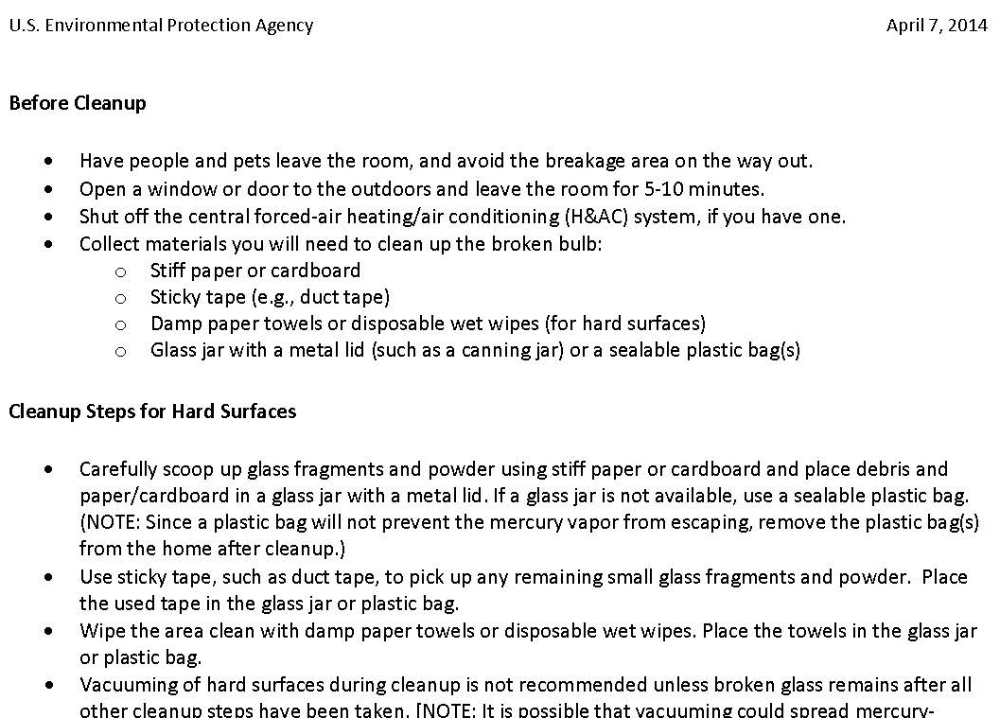
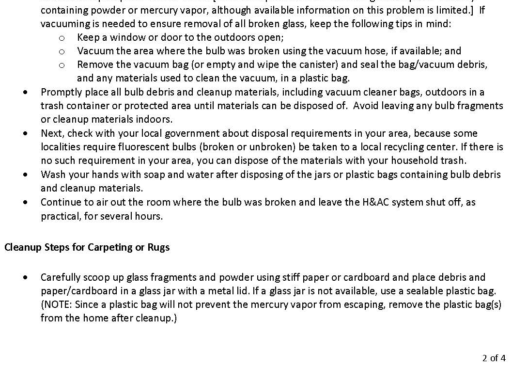

# 19. Bulb Replacement

*Source PDF pages 32–33.*

## Figures

---

<!-- PDF page 32 -->
19.    BULB REPLACEMENT
The bulbs will gradually lose UVB output with operating time and the number of ON-OFF cycles.
This means that your treatment times will probably increase in order to achieve the same effect on
your skin. After five to ten years, many home users find that their treatment times are significantly
longer than when the system was new, but otherwise the treatments are still effective.
You have three options: 1) tolerate the longer treatment times, 2) replace the bulbs, ideally all at the
same time to prevent “hot spots” and localized overexposure, or 3) expand your system by
purchasing ADD-ON devices and relocating the new more powerful bulbs evenly throughout the
system, as explained in the ADD-ON Device Installation section.

When a bulb gets very old, the glass at the ends of the bulb will blacken, and then the bulb will burn
out completely. If this happens, stop using the system and order replacement bulbs. Do not operate
the system with a burned-out bulb.

When replacing bulbs, it is extremely important that exposure times are significantly reduced.
Without the benefit of a UVB light meter to determine the ratio of old to new bulb output, our
recommendation is to start from the beginning of your exposure guideline table using the “initial
treatment time” specific to your skin condition, the number of devices, and skin type if applicable. New
bulbs can be very powerful and must be treated with respect! Don’t get burned!

             WARNING: Significantly reduce your treatment exposure time after installing new
             bulbs. Failure to may cause severe skin burns.

When installing new bulbs, another consideration is that brand new bulbs have very high UVB output
for a short period of time. For treatment predictability, it is important that brand new bulbs be
“burned-in” for 20 minutes prior to use. The instructions below include a 20-minute burn-in
procedure. Note: The bulbs in all new devices are “burned-in” at Solarc Systems. It is not necessary to
repeat the “burn-in” procedure.

           CAUTION: After installing new bulbs, perform a “burn-in” to stabilize the ultraviolet
           output. Failure to may cause unpredictable treatment results.

Due to the risk of shipping damage, the bulbs are intentionally difficult to remove. It is therefore
important that the following instructions and safety advice are followed carefully. Beware that if a bulb
is broken, it will explode and send glass fragments flying. Do not take a chance with this!

         CAUTION: Wear safety goggles and gloves when handling bulbs. Failure to can result
         in flying glass fragments causing eye and skin damage.
 If a bulb breaks, for clean-up instructions see "What to Do if a Fluorescent Light Bulb Breaks
 in Your Home" in Appendix B.

32             Solarc E-Series UVBNB Phototherapy System UNIVERSAL User’s Manual Rev 3.3A

<!-- PDF page 33 -->
TO CHANGE THE BULBS:

1.  Wear both safety glasses and gloves when working near the bulbs.
2.  Detach the power supply cord and remove the key from the switchlock.
3.  Plan a place to safely store the bulbs you are about to remove.
4.  Remove the wire guard or Clear Acrylic Window. To remove the wire guard, remove the screws
    holding the black plastic P-clips on both sides of the guard, pull up on the guard to release it from
    behind the lower endcap, and then push down on the guard to release it from behind the upper
    endcap.
5. Note the orientation of the bulbs, with the printing on the glass at the top facing out so it can be
    easily read.
6. At the end of each bulb tube is a white plastic spring loaded lampholder. The bulb tube floats
    between the two lampholders, acting as a shock absorber in shipping. Remove each bulb
    individually by carefully grasping the top of the bulb with a gloved hand and pushing down towards the
    bottom spring loaded lampholder until the bottom spring is fully compressed and hold it there.
    Then, at the top of the bulb, with great care using a knife or small sharp screwdriver, separate the
    black part of the bulb from the white lampholder and compress the spring loaded lampholder upward
    as far as possible. Then, while holding the lampholder compressed, move the top of the bulb aside
    and remove the bulb. Set the bulb aside carefully and repeat for all the other bulbs.
7. Reinstall the bulbs, one at a time and with the printing on the glass at the top and pointing out, by
    placing the bottom end of the bulb into the bottom spring loaded lampholder, pushing down, and
    then placing the top of the bulb into the top lampholder. It will be necessary to again compress the
    top spring loaded lampholder to achieve this. Make sure that the ends of the bulbs are fully into
    the lampholders.
8. Re-install the wire guard or Clear Acrylic Window. To install the wire guard, push up on the guard
    so the vertical wires at the top insert behind the top endcap flange, then push down on the guard
    so the vertical wires at the bottom insert behind the lower endcap flange. Then reinstall the black
    plastic P-clips.
9. Reattach the power supply cord.
10. BURN-IN: If new bulbs have been installed, perform a 20-minute bulb “burn-in”. Put on your
    ultraviolet protective goggles, set the timer for 20 minutes, start the timer, leave the room, and
    wait for the system to turn off.
11. Dispose of the old bulbs according to local regulations. See lamprecycle.org for more information.

                       WARNING: Fluorescent lamps contain MERCURY. For safe handling
                       procedures, measures to be taken in case of accidental breakage, and
                       options for disposal & recycling; please visit: LAMPRECYCLE.ORG
                       Dispose of or recycle in accordance with applicable laws.

Please call Solarc Systems at any time if you need any assistance removing or replacing the bulbs.

         Solarc E-Series UVBNB Phototherapy System UNIVERSAL User’s Manual Rev 3.3A                    33

