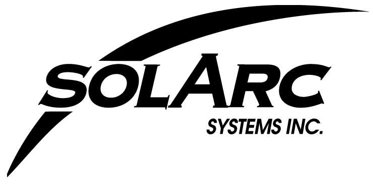
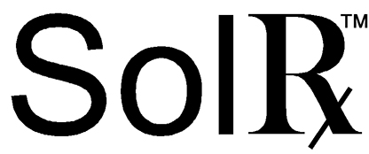
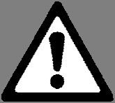
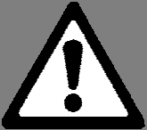

# PDF page 1

### Images on this page

---

                 E-Series Expandable Ultraviolet
                   Phototherapy Lamp Unit(s)
          For the treatment of psoriasis, vitiligo, atopic dermatitis (eczema)

                         USER’S MANUAL
                 UVB-Narrowband Models:
                E720, E740, E760, E780, E790
                and their various Multidirectional (MD) configurations

                            Solarc Systems Inc.
     1515 Snow Valley Road, Minesing, Ontario L9X 1K3 CANADA
    Toll Free Phone: 866-813-3357 (705-739-8279) Fax: 705-739-9684
     Email: info@solarcsystems.com        Web: SolarcSystems.com

            WARNING: Read and understand this User's Manual in its entirety before
            using the equipment. If you have questions, consult your physician or call
            Solarc Systems toll free: 866-813-3357 (705-739-8279).

             WARNING: Use of this equipment must be accompanied by physician
             examination (skin check) at least once per year; this is a condition of sale.

            CAUTION: US Federal law restricts this equipment to sale by or on the order
            of a physician. This equipment is to be used only by the person to whom it
            is prescribed.

                 Ce manuel d'utilisation est également disponible en français.
                 Este Manual del Usuario también está disponible en español.

©Solarc Systems Inc. May-2026

        Solarc E-Series UVBNB Phototherapy System UNIVERSAL User’s Manual Rev 3.3A

