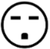
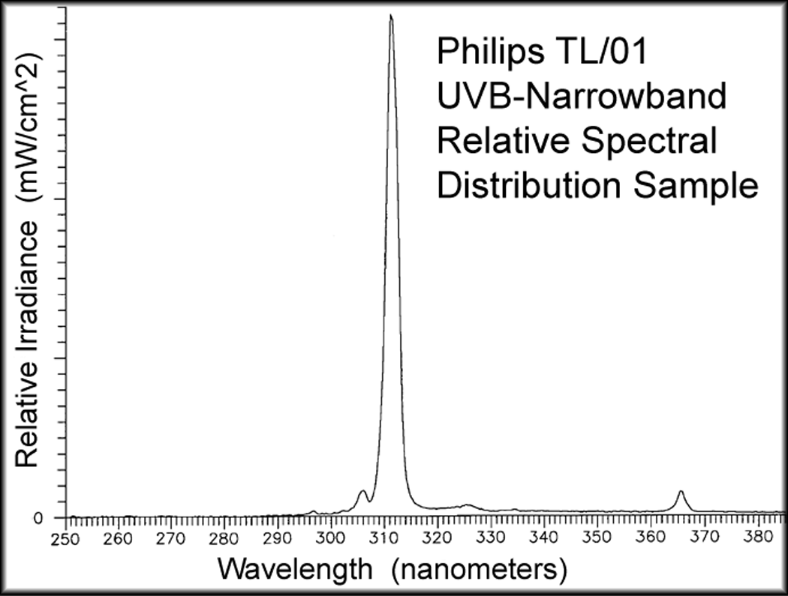

# PDF page 4

### Images on this page

---

SPECIFICATIONS TABLE 2
E-Series Model:      E720M-UVBNB        E740M-UVBNB        E760M-UVBNB        E780M-UVBNB         E790M-UVBNB
(Add "-230V" for     E720A-UVBNB        E740A-UVBNB        E760A-UVBNB        E780A-UVBNB         E790A-UVBNB
208-240V models)                        E740C-UVBNB
Frame Size           Small              Medium             Medium             Large               Large
Number of Bulbs      2                  4                  6                  8                   10
per Device
Maximum              12@120V            16@120V            16@120V            16@120V             16@120V
allowable total      12@208-240V        24@208-240V        24@208-240V        24@208-240V         24@208-240V
number of BULBS
in a SYSTEM
Nominal              Based on the maximum nominal steady state Irradiance at the midpoint center of the
UVB-Narrowband       device(s) at a distance of 10” from the plane of the front surface of the bulbs. The Nominal
Irradiance           UVB Irradiance value is estimated using new bulbs burned-in for 20 minutes at ambient
(mW/cm^2)            temperature ~20°C; as taken with an International Light IL1400 ultraviolet radiometer
As used in           calibrated for UVB-Narrowband. Irradiance is NOT affected by supply voltage.
Appendix D
                     The maximum Irradiance is at the lateral and vertical center of the device(s).

1 Device             2.5 (E720M)        4.5 (E740M)        6   (E760M)        7 (E780M)           8 (E790M)
2 Devices            4   (MD22)         6.5 (MD44)         9   (MD66)
3 or more Devices    5   (MD222+)       7.5 (MD444+)       10  (MD666+)
Other Common                            MD242: 7.5         MD262: 9           MD282: 9.5          MD292: 10
Multidirectional                        SMALL-HEX
Systems                                 E740-HEX
Current (Amps) per   1.4@120V           2.8@120V        4.2@120V              5.5@120V            6.8@120V
ADD-ON Device*       0.8@208-240V       1.6@208-240V    2.4@208-240V          3.2@208-240V        4.0@208-240V
Power Supply Cord    IEC C13 to         IEC C19 to NEMA 5-15P ►
Included, 120V       NEMA 5-15P         SJT14-3
Must be Grounded!    SJT16-3            (14 gauge, 3C)
                     (16 gauge, 3C)
Power Supply Cord    IEC C13 to         IEC C19 to NEMA 6-15P ►
Included, 208-240V   NEMA 6-15P         SJT14-3
Must be Grounded!    SJT16-3            (14 gauge, 3C)
                     (16 gauge, 3C)
Device Weight        34 lbs [15.5kg]    46 lbs [20.9kg]    48 lbs [21.8kg]    62 lbs [28.2kg]     65 lbs [29.5kg]
Device               73x14x4"           73x21x4"           73x21x4"           73x28x4"            73x28x4"
Dimensions           [185x36x10cm]      [185x53x10cm]      [185x53x10cm]      [185x71x10cm]       [185x71x10cm]
Shipping Weight      48 lbs [21.8kg]    61 lbs [27.7kg]    63 lbs [28.6 kg]   78 lbs [35.5kg]     81 lbs [36.8kg]
Shipping             78x17x7"           78x25x7"           78x25x7"           78x33x7"            78x33x7"
Dimensions           [198x43x18cm]      [198x64x18cm]      [198x64x18cm]      [198x84x18cm]       [198x84x18cm]
* Add nominally 0.1 amps for the MASTER device.

     Suggested treatment times are located
       at the back of this User's Manual in
    Appendix D: Exposure Guideline Tables

4              Solarc E-Series UVBNB Phototherapy System UNIVERSAL User’s Manual Rev 3.3A

