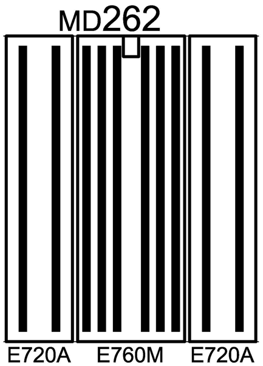
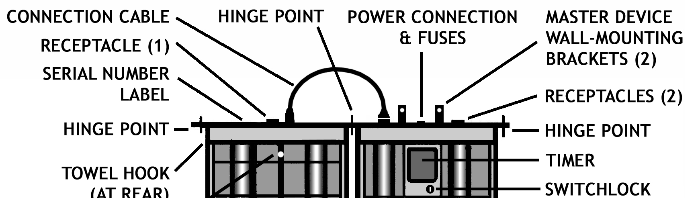

# PDF page 8

### Images on this page

---

1. INTRODUCTION
Thank you for purchasing a SolRx E-Series UVB Phototherapy System. We are confident that it will
provide you with years of trouble-free use. Should you have any questions regarding the equipment
or this User's Manual, please call Solarc Systems anytime using our toll-free number 866-813-3357
(705-739-8279). We will do our best to assist you.

Before you proceed with your first treatment, it is important that you read and understand this User's
Manual in its entirety, and that you consult your physician to obtain a treatment plan designed for
your specific needs. The instructions from your physician shall always take priority over this User’s
Manual. The information provided in this User's Manual serves only as a general guideline and is a
collection of generally accepted facts about UVB phototherapy. While all the information provided is
important, the following bears repeating:

• Always wear the goggles! Ultraviolet light can permanently damage your eyes. Don’t be fooled
  by the innocent look of the blue light. Ultraviolet light is invisible!
• Don’t take too much light in one session. Don’t get burned! Be conservative and don’t
  experiment carelessly. Do not repeat treatments within 24 hours.
• Because repeated exposure may contribute to premature aging of the skin and skin cancer, try to
  minimize the total cumulative use of the system over your lifetime. Find a balance between your
  treatment frequency, dose, skin condition and other treatment / lifestyle options. Don’t overdo it!

           WARNING: The instructions from your physician shall always take priority over this
           User’s Manual.

8              Solarc E-Series UVBNB Phototherapy System UNIVERSAL User’s Manual Rev 3.3A

