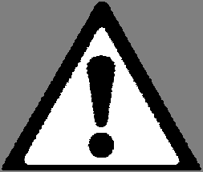

# PDF page 12

### Images on this page

---

5. EQUIPMENT SAFETY
As with all electrical appliances, this system must be operated using basic safety precautions,
including, but not limited to the following warnings:

           WARNINGS – EQUIPMENT SAFETY

 •   This is an ultraviolet-B (UVB) phototherapy lamp unit for the treatment of psoriasis, vitiligo
     and atopic dermatitis (eczema). IT IS NOT A TANNING BED. Do not use this system for any
     purposes other than those intended. Advise all persons involved that this is not a tanning
     bed. Explain the consequences of improper usage, including, but not limited to, eye
     damage and severe burns, even with exposure times as short as 10 seconds!
 •   Remove the key from the switchlock when not in use. If necessary, hide the key to prevent
     unauthorized use. (Turning the switchlock OFF also saves the energy consumed by the timer
     when it is in standby mode.)
 •   Supervise the operation of the system at all times. Parents/guardians should diligently supervise
     persons in their care.
 •   All persons exposed to the ultraviolet light must wear approved ultraviolet protective goggles.
     Additional goggles are available from Solarc Systems.
 •   Do not expose others to the ultraviolet light. Take your treatments in private. Supervising
     parents/guardians should cover exposed skin and stay as far away from the light as practical.
 •   Detach the power supply cord when cleaning or changing the bulbs, when servicing the system or
     when the system will not be in use for an extended period of time.
 •   To minimize electric shock hazard, do not use this system on or in water or other liquids, or in
     high humidity conditions, such as in a bathroom. Do not handle the plug or appliance with wet
     hands.
 •   Do not operate this system if any damage or malfunction is suspected. This includes, but is not
     limited to, physical damage, a damaged or modified power supply cord and a defective or erratic
     timer. Contact Solarc Systems should you suspect any problems.
 •   The wire guards provide only limited protection from bulb breakage. Take care to not fall into the
     bulbs. Do not operate the system if you have poor balance. For extra safety, consider purchasing
     the optional Clear Acrylic Window (CAW) feature, which is interchangeable with the wire guard.
 •   Do not touch the bulbs. The bulbs are hot, especially at the ends.
 •   Do not towel off or apply ointments to your skin while taking treatments. These activities increase
     the chance of bulb breakage, for example from the movements of your elbows.
 •   Do not listen to loud music when taking treatments. You must be able to hear the timer’s beeps
     indicating end of treatment.
 •   This system requires connection to an isolated, dedicated earth ground using the supplied three
     prong power supply cord, in accordance to the applicable electrical codes. Never modify the
     power cord so that it will fit in a two prong outlet. If an extension cord is required, ensure that
     it is: (a) in good condition, (b) 3-prong grounded type, (c) same or heavier wire gauge as the
     supplied power supply cord, and (d) as short as practical. Do not run cords under carpeting.
     Arrange cords to minimize tripping hazard.
 •   Respect the maximum number of devices and bulbs that may be connected together in a
     system, as indicated in the SPECIFICATIONS section. If exceeded, the fuse(s) located on
     the top endcap of the MASTER device will blow. Always use a replacement fuse of the same
     current rating and type (5x20mm, Slow-Blow/Low-Breaking). If the fuse blows repeatedly, call
     Solarc Systems toll free 866-813-3357 (705-739-8279).
 •   Only use the handles to move the devices, and keep your fingers clear of the pinch-point gaps
     between devices.

12             Solarc E-Series UVBNB Phototherapy System UNIVERSAL User’s Manual Rev 3.3A

