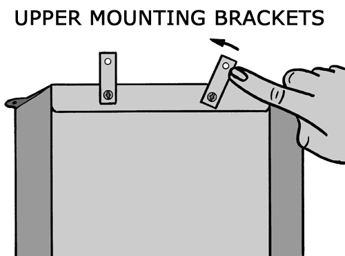
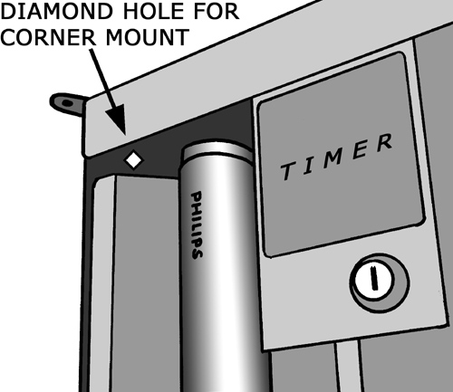
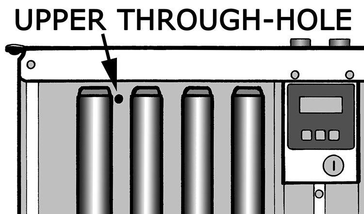
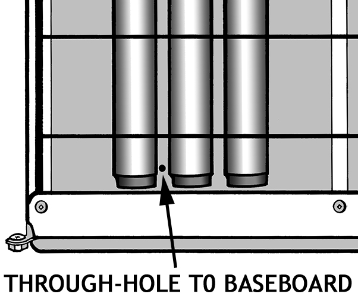
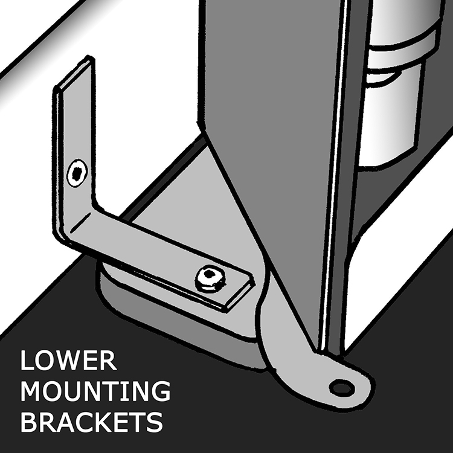

# PDF page 13

### Images on this page

---

6. INSTALLATION CONSIDERATIONS
Your E-Series system can be mounted almost anywhere in the home. The only restrictions are to
keep it away from water and high moisture areas such as a bathroom, and to avoid high traffic areas
where bulb breakage might occur, such as a hallway. Ideally, the system should be mounted on a
carpeted surface so the devices slide smoothly and quietly into position. If the system is mounted on
a hard surface such as a tiled floor, beware that the sliders could damage the surface, especially if
the floor is dirty. To prevent floor damage, consider putting an area rug under the system.

It is beneficial to take treatments immediately after a shower or bath, so pick a location that is private
and warm. Many patients install the system in their bedroom so it is easy to get dressed after their
treatments. Try to select a location that is close to a three-prong electrical outlet so that an extension
cord is not required.

If more than one MASTER is used (for example to create a full booth using only 120-volt devices),
each MASTER requires its own dedicated 15-amp 120-volt circuit, which is usually NOT available on
the same wall duplex outlet plate, and may NOT be available from other nearby outlets if they are on
the same circuit breaker in your home or building. If necessary, consult an electrical expert.

7. MASTER DEVICE INSTALLATION
The MASTER device (or simply the “MASTER”) is the device with the timer and switchlock. It is
always the first device needed in an E-Series system. If your device is a "CLINICAL MASTER"
(indicated by a "C" after the 3 digits in the model#), see instead the "E-Series E740-HEX FULL
BOOTH WITH BASEPLATE Assembly Instructions User's Manual Supplement", and the "Solarc C01
Timer User's Manual Supplement", if so equipped.

To prevent devices from falling, it is very important that one device in the system be fastened to the
wall at the top, with the bottom of the device and all its weight resting on the floor. This is typically the
MASTER device. It is NOT acceptable to “hang” devices on the wall. Devices are always installed
vertically - never mount devices horizontally so the patient lies down for treatment.

SPECIAL CASE: Alternatively, for full booths only, which is typically six (6) devices arranged in a
hexagon, "Locking Struts" are available to lock the devices in position so together they form a fixed
stable assembly, in which case none of the devices need to be fastened to a wall. See section
"Larger Systems & Full Booths".

           DANGER: One (1) device must be fastened to the wall as directed.
           Do NOT “hang” devices on the wall - all the weight must rest on the floor.
           Never mount devices horizontally so the patient lies down for treatment
           Failure to may result in device(s) falling causing severe injury.

The MASTER can be mounted two different ways: 1) against a flat wall, or 2) in a corner.
If ADD-ON devices might be added later to expand your system, mounting the MASTER against a flat
wall is necessary so there is space on the sides for more devices. This is the preferred mounting.
If the MASTER will only ever be used by itself, it can alternatively be corner mounted, but beware that
dropping something behind it will require that the device be dismounted for retrieval.

         Solarc E-Series UVBNB Phototherapy System UNIVERSAL User’s Manual Rev 3.3A                        13

