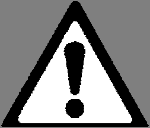
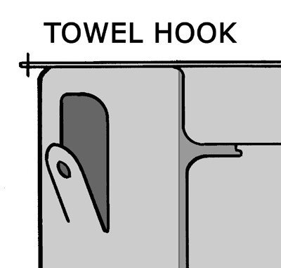
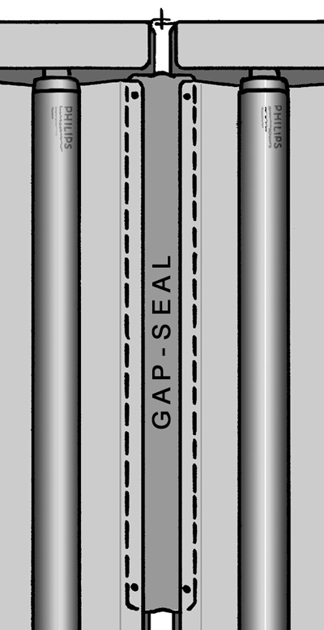
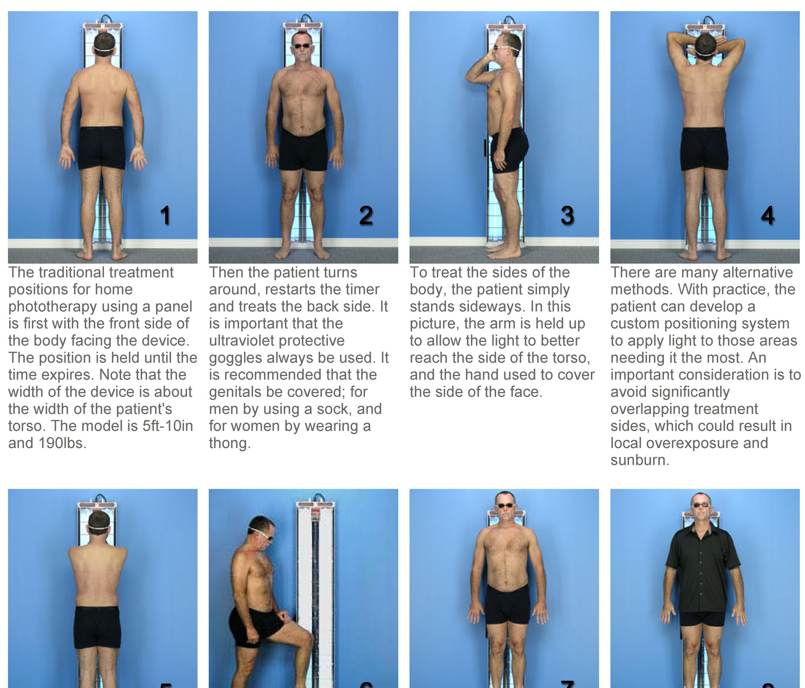
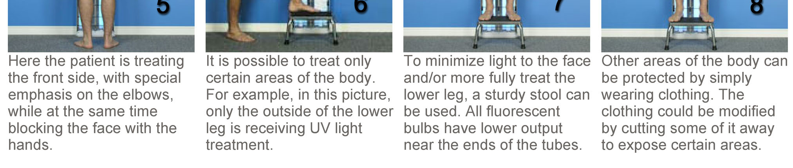

# PDF page 20

### Images on this page

---

The SMALL-HEX comes with two “H” locking struts and two “L” locking struts. Tiny arrows on the
parts point to the holes used for a 120° angle between adjacent devices. The other holes are for 100°
and 130° angles between adjacent devices. There are two possible geometric configurations as
shown below: With all interior angles set to 120° the distance between bulbs is 24.9 inches OR with
interior angles set to 100° and 130° the distance between bulbs is 22.2 inches. You may also choose
to use the SMALL-HEX without any locking struts, which allows continuous booth size changes, but
one device must be fastened to the wall at the top to stabilize the system.

The SMALL-HEX also has two door configuration options. DOUBLE DOORS require booth entry from
the short end of the booth. CONJOINED DOORS use the 1306-L Locking Strut to connect a pair of 2-
bulb devices, which makes for better booth entry geometry and only one “door” to operate. It is not
recommended to use the larger 4-bulb device as a door because it is too heavy.

           WARNING: Use of the SMALL HEX booth may result in an exposure distance less
           than the minimum 8 inches (20cm) recommended, especially for larger patients.
           Reduce treatment times and proceed cautiously. Failure to may cause skin burns.
 Alternatively, the device assembly can be opened up to form a C-shape for more space.

          DANGER: All E-Series systems must be prevented from falling over, by either
          fastening one device to a wall as directed, or in the case of full booths, using
          "Locking Struts" to lock the devices in position. Failure to may result in device(s)
          falling causing severe injury or death.

Another option to create a large full booth if only 120V power is available, is to use two (2) MASTER
devices and operate the two timers simultaneously. In this case each MASTER device must be
connected to its own dedicated 15-amp 120-volt circuit, which is usually NOT available on the same
wall duplex outlet plate, and may NOT be available from other nearby outlets if they are on the same
circuit breaker in your home or building. If necessary, consult an electrical expert.

20            Solarc E-Series UVBNB Phototherapy System UNIVERSAL User’s Manual Rev 3.3A

