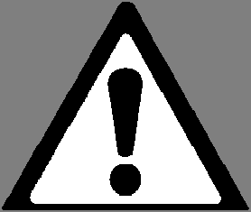

# PDF page 24

### Images on this page

---

One set of ultraviolet protective goggles is supplied with the MASTER device and must be used for
every treatment, regardless of the exposure time. Adjust the headband so that they seal with your
face and do not leak any light. Never look at the light without using the ultraviolet protective
goggles provided. The bulbs have what appears to be an innocent blue glow; however, what
you do not see is high levels of invisible ultraviolet radiation that can severely damage your
eyes. Use only eye protection approved for UVB such as those supplied with this SolRx Unit. Do not
use any other eyewear. If in doubt, check with your physician or contact Solarc Systems toll free at
866-813-3357 (705-739-8279). This applies to all persons exposed to the ultraviolet light, such as a
supervising parent or guardian. Note: If the goggles are covering your eyes, it is acceptable to look at
the light, but ideally only briefly.

         WARNING: Always wear the ultraviolet protective goggles supplied; failure to may
         result in severe burns or long-term injury to the eyes.

The following pictures show some of the possible body positions using just a single E720
2-bulb MASTER device. For larger systems, the body positions are similar, but fewer are
needed to get full 360˚ coverage around the patient’s body.

24             Solarc E-Series UVBNB Phototherapy System UNIVERSAL User’s Manual Rev 3.3A

