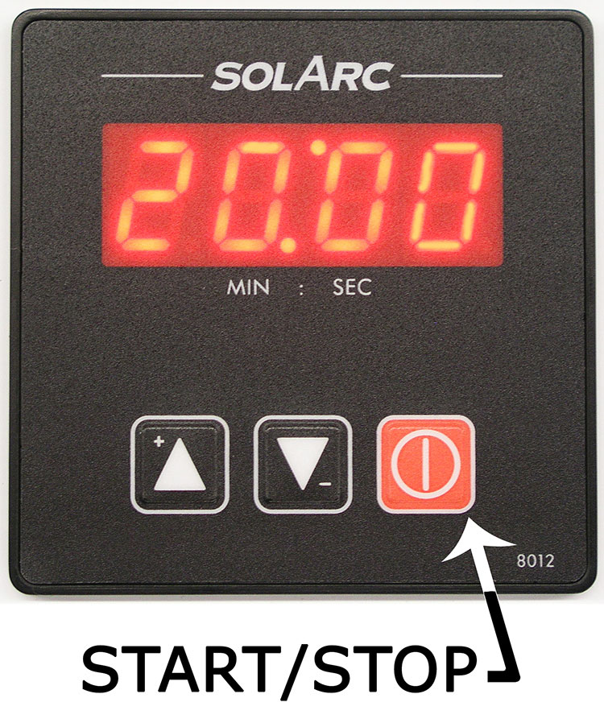
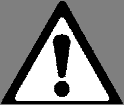

# PDF page 27

### Images on this page

---

    prescribed this type of drug.
12. Some skin diseases normally responsive to ultraviolet light can instead have a negative reaction.
    Stop taking treatments and consult your physician if you suspect this may apply to you.
13. When treating the face, some patients may develop a sharp contrast in skin pigment between the
    skin covered by the goggles and the adjacent exposed skin; sometimes called “raccoon eyes”.
    To minimize this effect, try placing the goggles in a slightly different position for each treatment.
    Alternatively, the goggles can be moved slightly during treatment, but move them only with both
    eyes tightly closed and the goggles in contact with your skin to prevent eye exposure.
14. If treating the face, head or scalp; avoid radical hairstyle and facial hair changes that might result
    in overexposure of previously hair-covered areas of skin.
15. The term “Edema” is used in the Exposure Guideline Tables. It is defined as the presence of
    abnormally large amounts of fluid beneath the skin. Should this occur, stop treatments and
    consult your physician.
16. If you experience a rapid and severe skin flare-up, consider with your physician the possibility that
    it may be “guttate” psoriasis caused by an infection, in which case it should be treated as soon as
    possible to avoid it developing into chronic psoriasis. Treatment options may include antibiotics
    and this UVB system.
17. UVB makes large amounts of Vitamin D in the skin - beware concurrently taking large amounts of
    Vitamin D tablets. Evaluate the risk by getting a 25(OH)D blood test.

PSORIASIS ONLY: When your psoriasis “clears” (heals), do not continue to increase the exposure
times; instead switch to the “Psoriasis Long Term Maintenance Program”. Psoriasis “clearing” is
generally defined as complete flattening of psoriatic plaques and borders, with the cleared plaque
often initially less pigmented (whiter) than the adjacent skin. There should be at least a 95%
improvement compared to the original condition.

EXPOSURE GUIDELINE TABLES with suggested treatment times are provided in Appendix D
at the back of this User's Manual. Do the following:
1. Carefully select the Exposure Guideline Table applicable to your E-Series phototherapy system (be it
    a single MASTER device or one of the multidirectional "MD" systems), and your skin condition:
    PSORIASIS OR VITILIGO OR ATOPIC DERMATITIS (ECZEMA).
2. For PSORIASIS patients, select the appropriate row in your exposure guideline table that applies to
    your Skin Type.
3. In pencil cross off any information that is not relevant. Using a pencil will allow you to erase and
    change if necessary, for example if you later purchase ADD-ON devices.
4. Consider moving or copying your Exposure Guideline Table page to the front of this User's Manual for
    quick reference.

            WARNING: Make sure that you use the correct exposure guidelines for your
            phototherapy system arrangement, skin condition, and skin type. Highlight the
            information that applies to you and cross out all other information that does not
            apply to you.
            Failure to may result in using the incorrect exposure times and overexposure.

Treatment times are listed PER BODY POSITION, with their associated dosages in mJ/cm^2 (milli-
Joules per square centimeter). The relation between dosage and treatment time is expressed by the
equation:

 TIME (seconds) = DOSE (mJ/cm^2) ÷ IRRADIANCE (mW/cm^2)
Exposure times are based on the system's maximum nominal steady-state irradiance at the midpoint
center of the system, as listed in SPECIFICATIONS TABLE 2.

         Solarc E-Series UVBNB Phototherapy System UNIVERSAL User’s Manual Rev 3.3A                    27

