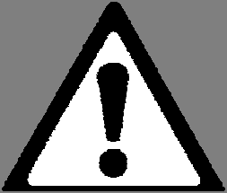

# PDF page 28

### Images on this page

---

             CAUTION: The Nominal UVB Irradiance values are for NEW bulbs, are
             approximations only, and subject to many variables including, but not limited to:
             presence and cleanliness of a Clear Acrylic Window (CAW) in front of the bulbs, bulb
 usage, bulb preheat time, bulb operating time, ambient temperature, bulb manufacturing variance,
 reflector quality, and skin surface: (a) distance from the bulbs, (b) position relative to the bulbs,
 and (c) angle to the bulbs. The dosage times and dosage time maximums provided in the
 Exposure Guideline Tables are therefore approximations only. See Discussion below.
 If accurate dosage times are required, do not use the Exposure Guideline Tables provided.
 Instead, take regular UVB Irradiance readings using a calibrated light meter (not provided) and
 calculate the dosage times and dosage time maximums using the equation provided.

Discussion: Generally, if care is taken to be consistent with your treatments and overexposure is
avoided, the effects of irradiance variability are minimized. The exposure guideline tables are
designed so that the treatment results are evaluated after every treatment, providing the necessary
corrections for any drift in irradiance. Consequently, effective treatments can be provided for years,
even as the bulbs age and lose power, or even as the user’s dosage requirements change. It is
normally NOT necessary to take light meter readings for UVB home phototherapy.

Timer Characteristics:
1. The timer’s display reads in “minutes:seconds”, such as
   “12:34” for 12 minutes:34 seconds.
2. The timer’s maximum time setting is 20:00
   minutes:seconds.
3. The timer provides three (3) audible “triple-beeps” at the
   end of the countdown cycle, after which it will reset to the
   previous time setting. Always verify that the lights turn off
   at the sound of the beeps.
4. The timer always retains its last time setting, even if power
   is removed from the system for a long time. Use this useful
   feature to verify your previous treatment time setting.
5. If a power failure occurs when the system is operating, the
   timer will retain the time remaining. Press START/STOP to
   resume the session.
6. Should the timer behave erratically in any way, or fail to
   turn off the lights at the end of the cycle, please contact
   Solarc Systems immediately and do not use the system.

Note: The MASTER device label states that the “Initial exposure time per area should not exceed 10
seconds”. This is provided for the safety of people that have not read the User's Manual and/or for
people that may mistake the system for a tanning bed.

28             Solarc E-Series UVBNB Phototherapy System UNIVERSAL User’s Manual Rev 3.3A

