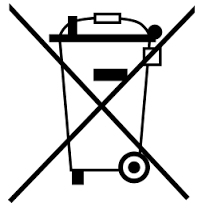

# PDF page 30

### Images on this page

---

15.    PSORIASIS LONG TERM MAINTENANCE PROGRAM
Psoriasis “clearing” is generally defined as complete flattening of psoriatic plaques and borders, with
the cleared plaque often initially less pigmented (whiter) than the adjacent skin. There should be at
least a 95% improvement compared to the original condition.

After your skin has “cleared”, there are a couple of options available. For patients with psoriasis that
returns only after several months without phototherapy, the best option may be to wait for the
condition to return before restarting treatments from the beginning. This may minimize your total
lifetime cumulative ultraviolet dose.

For patients with a more severe condition, the best approach may be to continue treatments on a
schedule of diminishing frequency until maintenance is established. Start with the same treatment
time as used to achieve clearing and reduce the number of exposures per week by one for every two
weeks of treatments. For example, someone that achieved clearing using a schedule of 4 times per
week would start maintenance treatments at 3 times per week for 2 weeks, then 2 times per week for
the next 2 weeks, and so on. Use the same “clearing” treatment times for all treatments unless
significant erythema (burning) occurs or the psoriasis returns, in which case the following actions
should be considered, all subject to the advice of your physician:

a) Erythema (sunburn) – Ultraviolet tolerance may diminish during the maintenance program.
   Decrease each subsequent treatment time by 25% until erythema does not occur. Then resume
   the maintenance schedule. If there is difficulty re-establishing the correct treatment time, consider
   restarting from the beginning using your Exposure Guideline Table.
b) New Areas of Psoriasis – Increase treatment times according to your Exposure Guideline
   Table, but keep your current maintenance treatment frequency (number of treatments per week).
   When clearing is achieved, continue to use this new “clearing” treatment time and resume the
   maintenance program.
c) Psoriatic Flares – Defined as psoriasis returning to more than 5% of the original plaque sites,
   psoriatic flares normally require increasing the treatment frequency (number of treatments per
   week) until clearing is achieved. For example, someone experiencing psoriatic flares using a
   schedule of 1 time per week would increase maintenance treatments to 2 times per week for 2
   weeks, then 3 times per week for the next 2 weeks, and so on up to the maximum times per
   week advised by your physician, and until clearing is achieved and a new balance is found.
   See also item 16 in the General Exposure Guidelines sub-section regarding guttate psoriasis.

If treatments have not been taken for 4 weeks, your tolerance to erythema (sunburn) will be
significantly reduced. It may be necessary to restart from the beginning using your Exposure
Guideline Table.

Establishing a long term maintenance program is a very individual matter. It will likely take some effort
to determine the optimum maintenance program that balances the control of your psoriasis and
minimizes your total lifetime cumulative ultraviolet dose. Consult your physician for the best schedule
for you. Remember that the risks outlined in this User’s Manual make it important that your skin be
examined by a physician at least once per year.

           WARNING: Use of this system must be accompanied by physician examination
           (skin check) at least once per year; this is a condition of sale.

30             Solarc E-Series UVBNB Phototherapy System UNIVERSAL User’s Manual Rev 3.3A

