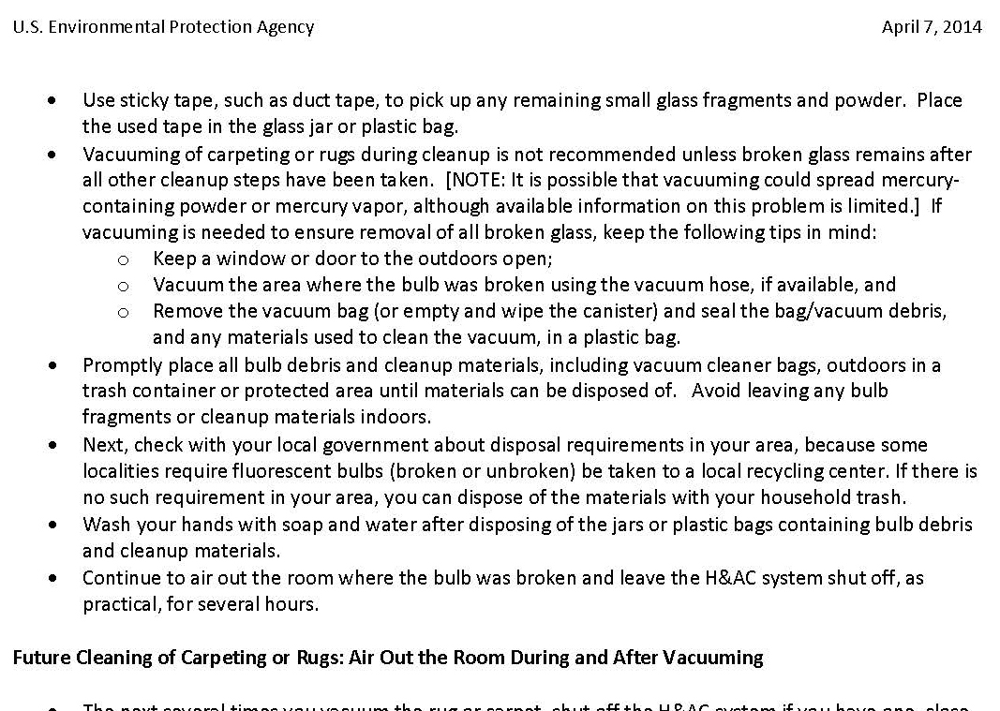
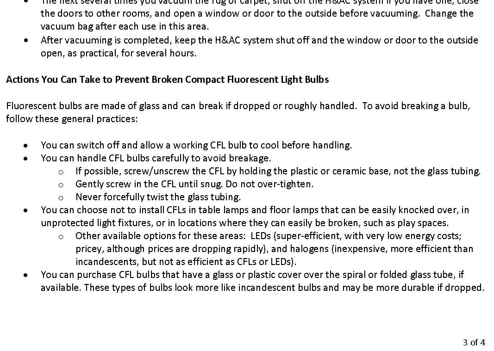
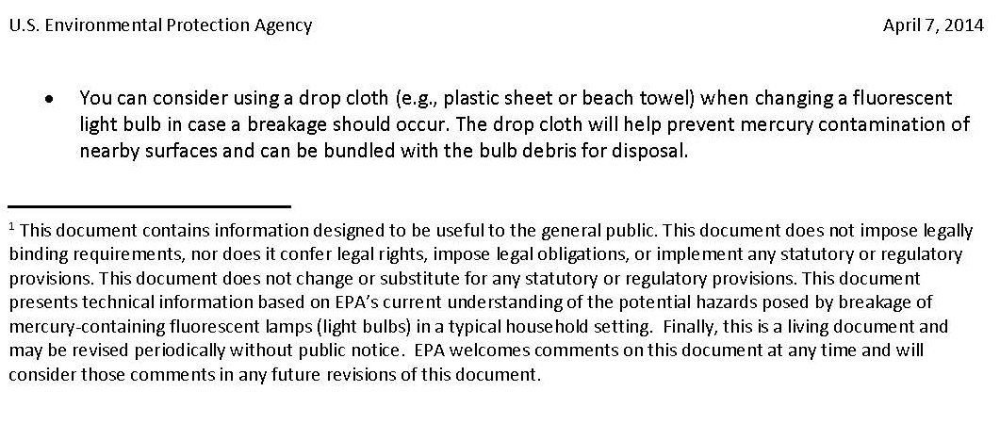

# PDF page 34

### Images on this page

---

20.    TROUBLESHOOTING
Generally, these devices are very reliable; however, there may be occasion in the lifetime of a device
when a fuse blows; or a bulb, ballast or timer fails.

If this happens, first remember the possibility of the person working on the system getting
burned, even with exposure times as short as 10 seconds! Supply the troubleshooter with this
User's Manual. Wear ultraviolet protective eyewear and clothes that will block the light. Wear a
sunscreen with a minimum sun protection factor of 40 (SPF40) on any exposed skin and minimize
exposure, but do not get any sunscreen on the bulbs or Clear Acrylic Window. When testing, consider
temporarily covering the system with a blanket to block the light.

            DANGER – Ultraviolet radiation. Protect exposed skin when testing and minimize
            exposure time. Overexposure can cause severe burning. Wear protective eyewear.
            Failure to may result in severe burns or long-term injury to the eyes.

Electrical work should be performed by qualified individuals. Detach the power supply cord and
remove the key before removing any bulbs or the back cover.

           DANGER – Disconnect the power supply cord and remove the key when cleaning or
           changing the bulbs, or when servicing the system.

No Device Power

If the MASTER device and its timer do not light up:
     1. Verify that the electrical wall outlet has power by plugging in some other appliance. If there is
        no power, check the circuit breaker in the building's electrical panel and reset it if necessary.
     2. Check that the device's power supply cord is fully inserted into the wall outlet.
     3. Check that the power supply cord is pushed fully down into the power inlet on the top of the
        MASTER device.
     4. Ensure that the switchlock key is ON.
     5. Consider that the system may not work with a ground fault circuit interrupter (GFCI) outlet, or
        that the GFCI outlet is defective. Try a different outlet.

If the problem persists, it is possible that a device fuse has blown. Detach the power supply cord and
remove the key, then on the top of the MASTER device, unscrew the top of the black plastic
fuseholders (or open the fuseholder drawer) and remove the fuse(s). Inspect the fuse(s) and replace
as necessary. Always use a fuse of the same type and amp rating, as listed on the labeling. Never
use a fuse with a larger amp rating. Note that 120-volt devices have only one (1) active fuse,
whereas 208-240 volt devices have two (2) active fuses.

Broken Bulb(s)

If a bulb breaks, for clean-up instructions see "What to Do if a Fluorescent Light Bulb Breaks in Your
Home" in Appendix B.

34             Solarc E-Series UVBNB Phototherapy System UNIVERSAL User’s Manual Rev 3.3A

