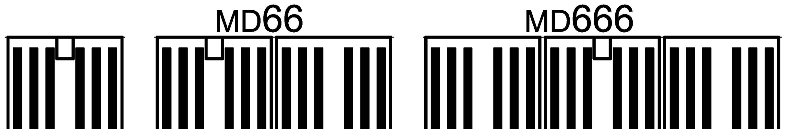
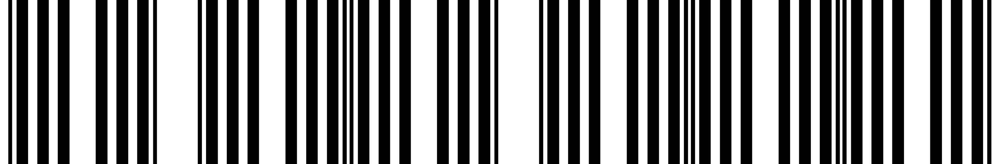

# PDF page 38

### Images on this page

---

APPENDIX A - Electrical Schematic for 208-240V models: E740M-230V,
E760M-230V, E780M-230V, E790M-230V And Clinical model E740C-230V

      Solarc E-Series UVBNB Phototherapy System UNIVERSAL User’s Manual Rev 3.3A

