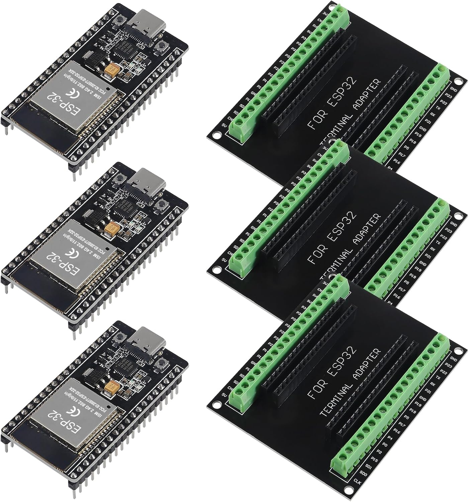

# ESP32 development board + screw terminal breakout

Product: [Amazon B0C8DBN29X](https://www.amazon.com/dp/B0C8DBN29X) — **DORHEA** “3 Set ESP32 Development Board Type C **38-pin narrow** … with ESP32 Breakout Board GPIO 1 into 2 Terminal Screw Board”.



## What’s in the kit

| Item | Qty (this listing) | Notes |
|------|--------------------|--------|
| ESP32 Type-C **38-pin narrow** dev board | 3 | Module labeled **ESP-32**; USB-C; BOOT + EN (reset) buttons |
| Screw-terminal “GPIO 1 into 2” breakout | 3 | Silk: **FOR ESP32 TERMINAL ADAPTER**; each header pin doubled to a green terminal |

**Compatibility (seller):** breakout fits **38-pin narrow** ESP32 boards **without** mounting holes. Does **not** fit classic **ESP-WROOM-32 DevKit V1** (different pin pitch / width). Confirm pin row spacing before seating the board.

### Product photos (seller)

| Image | File |
|-------|------|
| Kit overview | [esp32-kit-overview.jpg](images/esp32-kit-overview.jpg) |
| Module / USB-C close-up | [esp32-board-closeup.jpg](images/esp32-board-closeup.jpg) |
| Type-C board + adapter | [esp32-typec-and-adapter.jpg](images/esp32-typec-and-adapter.jpg) |
| Dimensions | [esp32-dimensions.jpg](images/esp32-dimensions.jpg) |

Seller dimension callouts (approximate): board ~**51 × 25 mm**; terminal adapter ~**77 × 63 mm**.

## Module / SoC identity

| Item | Detail |
|------|--------|
| Form | Shielded RF module on dual-row 38-pin carrier (DevKitC-style clone) |
| Module shield text (photo) | **ESP-32**, ISM 2.4G 802.11b/g/n, **FCC ID: 2AB7T-ESP32-32X**, CE |
| Listing names | ESP-32 / ESP-32S / **ESP-WROOM-32** class |
| CPU | Dual-core **Tensilica LX6**, up to **240 MHz** (listing) |
| SRAM | **512 KB** class (ESP32 internal; listing says 512 KB) |
| Flash | On-module SPI flash (typically **4 MB** on this class of board — **verify** with `esptool.py flash_id`) |
| Radio | **Wi‑Fi** 802.11 b/g/n + **Bluetooth** Classic and BLE (listing) |
| Modes (Wi‑Fi) | AP, STA, AP+STA (listing) |
| USB | **USB Type-C** for power + serial (download / console) |
| USB-UART | On-board bridge chip (common clones: **CH340C** or **CP210x**). **Read the IC marking** on the board you receive; Linux modules are usually `ch341` or `cp210x`. |
| Buttons | **EN** (reset / CHIP_PU), **BOOT** (hold BOOT + press EN → download mode) |

### Authoritative references (Espressif)

These boards follow the same **header map** as Espressif **ESP32-DevKitC** (38 pins). Prefer Espressif docs over Amazon prose when they disagree.

| Doc | URL |
|-----|-----|
| ESP32-DevKitC V4 user guide (header block / pin layout) | https://docs.espressif.com/projects/esp-dev-kits/en/latest/esp32/esp32-devkitc/user_guide.html |
| ESP32-WROOM-32 datasheet (classic module) | https://www.espressif.com/sites/default/files/documentation/esp32-wroom-32_datasheet_en.pdf |
| ESP32-WROOM-32E / 32UE datasheet (current module family) | https://www.espressif.com/sites/default/files/documentation/esp32-wroom-32e_esp32-wroom-32ue_datasheet_en.pdf |
| ESP32 SoC datasheet | https://www.espressif.com/sites/default/files/documentation/esp32_datasheet_en.pdf |
| ESP-IDF get started | https://docs.espressif.com/projects/esp-idf/en/latest/esp32/get-started/index.html |
| GPIO / strapping caveats (community pin guide) | https://randomnerdtutorials.com/esp32-pinout-reference-gpios/ |

**FCC ID note:** `2AB7T-ESP32-32X` appears on many third-party modules (not necessarily Espressif’s own shield printing). Treat the silicon as **ESP32** + WROOM-style module; confirm flash size and USB-UART chip on the unit in hand.

## Pinout (38-pin narrow — DevKitC-compatible)

Verified against:

1. Terminal adapter **silk labels** in seller photos (this kit).
2. Espressif **ESP32-DevKitC V4** header tables (J2 / J3).

Orientation: USB-C at the **top**. Left column = Espressif **J2**; right column = **J3**. Numbering is **top → bottom**.

### Left header (J2) — top → bottom

| # | Silk / name | GPIO / function |
|---|-------------|-----------------|
| 1 | **3V3** | 3.3 V rail (regulated on board) |
| 2 | **EN** | CHIP_PU / reset (also EN button) |
| 3 | **VP** | **GPIO36**, ADC1_CH0, SENSOR_VP — **input only** |
| 4 | **VN** | **GPIO39**, ADC1_CH3, SENSOR_VN — **input only** |
| 5 | **34** | **GPIO34**, ADC1_CH6 — **input only** |
| 6 | **35** | **GPIO35**, ADC1_CH7 — **input only** |
| 7 | **32** | **GPIO32**, ADC1_CH4, TOUCH9, XTAL_32K_P |
| 8 | **33** | **GPIO33**, ADC1_CH5, TOUCH8, XTAL_32K_N |
| 9 | **25** | **GPIO25**, ADC2_CH8, **DAC1** |
| 10 | **26** | **GPIO26**, ADC2_CH9, **DAC2** |
| 11 | **27** | **GPIO27**, ADC2_CH7, TOUCH7 |
| 12 | **14** | **GPIO14**, ADC2_CH6, TOUCH6, MTMS (HSPI CLK) |
| 13 | **12** | **GPIO12**, ADC2_CH5, TOUCH5, MTDI — **strapping** (flash voltage); avoid as general output if possible |
| 14 | **GND** | Ground |
| 15 | **13** | **GPIO13**, ADC2_CH4, TOUCH4, MTCK (HSPI MOSI) |
| 16 | **D2** | **GPIO9** — flash data; **do not use** for I/O |
| 17 | **D3** | **GPIO10** — flash; **do not use** |
| 18 | **CMD** | **GPIO11** — flash; **do not use** |
| 19 | **5V** | 5 V from USB (or external 5 V input — see power notes) |

### Right header (J3) — top → bottom

| # | Silk / name | GPIO / function |
|---|-------------|-----------------|
| 1 | **GND** | Ground |
| 2 | **23** | **GPIO23** (VSPI MOSI) |
| 3 | **22** | **GPIO22** — default **I²C SCL** |
| 4 | **TX** | **GPIO1**, U0TXD — USB-UART TX to PC; avoid for other uses |
| 5 | **RX** | **GPIO3**, U0RXD — USB-UART RX from PC; avoid for other uses |
| 6 | **21** | **GPIO21** — default **I²C SDA** |
| 7 | **GND** | Ground |
| 8 | **19** | **GPIO19** (VSPI MISO) |
| 9 | **18** | **GPIO18** (VSPI SCK) |
| 10 | **5** | **GPIO5** (VSPI CS) — strapping-related; usable carefully |
| 11 | **17** | **GPIO17** (UART2 TX) — free on WROOM (not WROVER PSRAM) |
| 12 | **16** | **GPIO16** (UART2 RX) — free on WROOM |
| 13 | **4** | **GPIO4**, ADC2_CH0, TOUCH0 |
| 14 | **0** | **GPIO0** — **BOOT** strapping; must be free/HIGH at reset for normal boot |
| 15 | **2** | **GPIO2** — strapping / often onboard LED on some boards |
| 16 | **15** | **GPIO15**, ADC2_CH3, TOUCH3, MTDO — strapping |
| 17 | **D1** | **GPIO8** — flash; **do not use** |
| 18 | **D0** | **GPIO7** — flash; **do not use** |
| 19 | **CLK** | **GPIO6** — flash clock; **do not use** |

### Seller “GPIO function classification” (listing)

Cross-check with the table above; listing matches common WROOM mapping:

| Bus / function | Pins (listing) |
|----------------|----------------|
| ADC (examples) | 32, 33, 34, 35, 36, 39 |
| DAC | 25, 26 |
| UART0 | TX **1**, RX **3** (USB serial) |
| UART1 | TX **10**, RX **9** (on flash pins — **not usable** as UART1 on WROOM) |
| UART2 | TX **17**, RX **16** |
| SPI HSPI | 14, 12, 13, 15 |
| SPI VSPI | 23, 19, 18, 5 |
| **I²C (default)** | **SDA 21**, **SCL 22** |

### Pins to avoid or treat carefully

| Pins | Why |
|------|-----|
| GPIO **6–11** (CLK, D0, D1, D2, D3, CMD) | Wired to module SPI flash |
| GPIO **34–39** | **Input only** (no internal pull-up/down) |
| GPIO **0**, **2**, **12**, **15** | **Strapping** pins; wrong level at reset → wrong boot mode / flash voltage issues |
| GPIO **1**, **3** | USB serial console |
| GPIO **12** | Must not be driven HIGH at boot on many modules (3.3 V flash) |

### Suggested pins for *this* project (provisional)

| Peripheral | Suggested ESP32 pins | Notes |
|------------|----------------------|--------|
| I²C SDA | **GPIO21** | LCD1602 backpack, keypad I²C, 7-seg I²C |
| I²C SCL | **GPIO22** | Shared bus @ ≤100 kHz for PCF8574 class |
| SSR (lamps) | **GPIO26** or **GPIO27** (pick one) | Digital out; **default LOW / off** at boot |
| Piezo | **GPIO25** or **GPIO4** | Digital or LEDC PWM tone |
| Spare UI / status LED | **GPIO2** only if no conflict with boot LED | Optional |

Finalize after measuring boot levels and any onboard LED; update this table when wired.

## Power

| Rail | Notes |
|------|--------|
| USB-C 5 V | Primary program + power path |
| Board **5V** pin | USB 5 V (can also accept external 5 V — **do not** feed 5 V and USB from conflicting supplies without care) |
| Board **3V3** | On-board regulator output for ESP32 and 3.3 V logic |
| Project plan | External **USB wall charger 5 V** feeds controller stack; ESP32 can take that 5 V on **5V** pin or via USB-C. **I/O is 3.3 V** — do not drive ESP32 GPIO with 5 V. |

**Level shifting:** LCD1602 backpack and many I²C modules run at **5 V**. ESP32 I²C is 3.3 V. Many PCF8574 boards tolerate 3.3 V SDA/SCL with 5 V VCC; for reliability prefer a bidirectional level shifter if bus noise or multi-drop issues appear.

## Programming (CLI)

1. Install USB-UART driver if needed (`ch341` / `cp210x`).
2. Port typically `/dev/ttyUSB0` or `/dev/ttyACM0`.
3. Download mode: hold **BOOT**, tap **EN**, release **BOOT** (many boards auto-reset via DTR/RTS).
4. Tools: `esptool.py` (flash), serial monitor at **115200** (common default; confirm with firmware).
5. Prefer **ESP-IDF** or **PlatformIO CLI** over Arduino IDE GUI (project preference).

Example identity check (after toolchain install):

```bash
esptool.py --port /dev/ttyUSB0 chip_id
esptool.py --port /dev/ttyUSB0 flash_id
```

## Open confirmations (on the unit in hand)

- [ ] USB-UART IC marking (CH340 vs CP210x vs other)
- [ ] Flash size from `flash_id`
- [ ] Exact module variant printed under shield (WROOM-32 / 32E / clone silkscreen)
- [ ] Whether GPIO2 has an onboard LED
- [ ] Terminal adapter pin order matches this table when board is seated (probe 3V3 / GND / TX first)

## Relationship to project power plan

See [README.md](../README.md) low-voltage section: internal USB charger provides 5 V for ESP32 + displays; SSR still switches **mains** to ballasts. Keep GPIO defaults **off** for the SSR so a brown-out or reboot does not leave lamps on.
