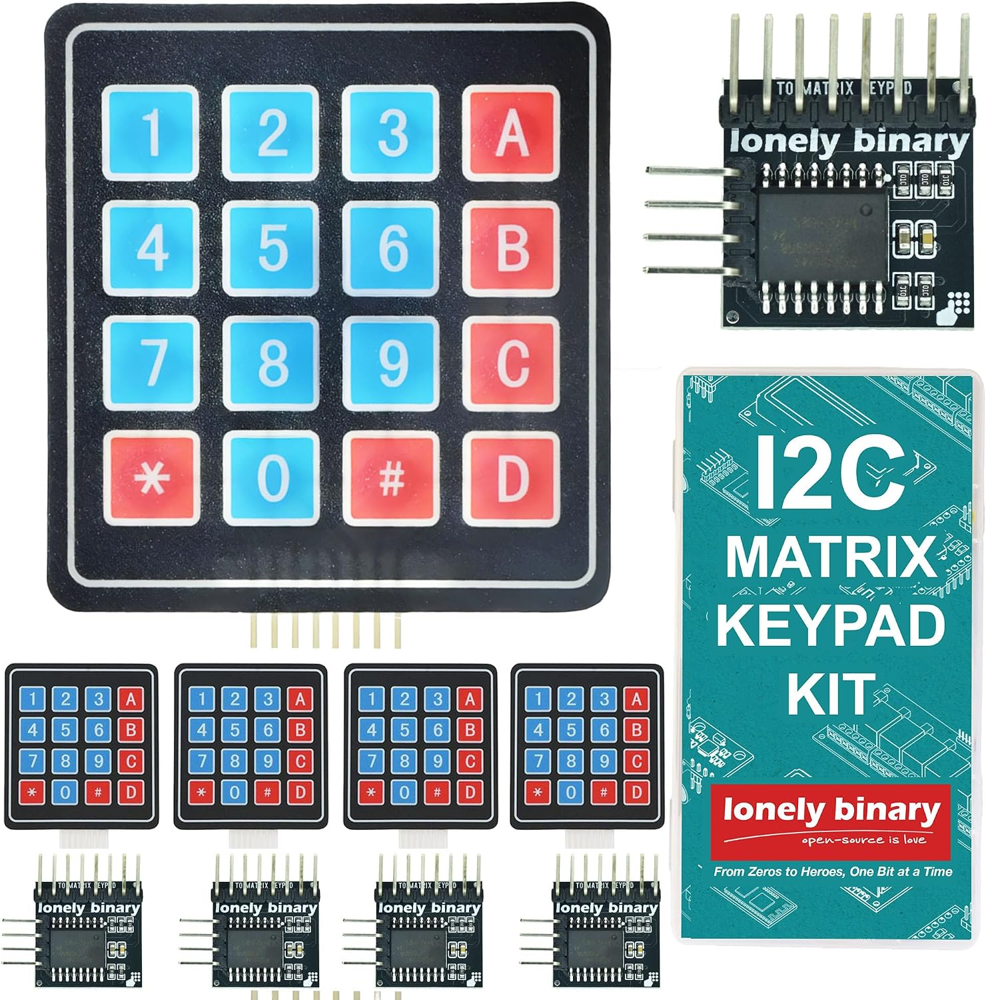

# I²C 4×4 matrix keypad

Product: [Amazon B0G2KZW8KX](https://www.amazon.com/dp/B0G2KZW8KX) — **LONELY BINARY** 5-set soft membrane 4×4 keypads + I²C adapters.



## What’s in the kit

| Item | Qty | Notes |
|------|-----|--------|
| Soft 4×4 membrane keypad | 5 | 16 keys; adhesive backing for panel mount |
| I²C adapter | 5 | **PCF8574**-based; turns 8-pin matrix into **SDA/SCL** |
| Storage case | 1 | — |

Without the adapter, a 4×4 matrix needs **8 GPIOs** (4 rows + 4 columns). With the adapter: **2 wires** on the shared I²C bus (plus power/ground).

## Electrical / interface

| Item | Detail |
|------|--------|
| Logic | **3.3 V – 5 V** (listing; OK with ESP32 3.3 V I²C) |
| Host pins | **SDA**, **SCL**, **VCC**, **GND** |
| Expander | **PCF8574** family on the adapter (same chip class as many LCD backpacks) |
| Libraries (Arduino-style) | e.g. `Keypad_I2C` / scan port + matrix decode |
| Multi-device bus | Multiple adapters can share one I²C bus if **A0/A1/A2** set unique addresses |

### I²C address

Same rules as [PCF8574 / PCF8574A](https://www.nxp.com/docs/en/data-sheet/PCF8574_PCF8574A.pdf) (see also [lcd1602-i2c.md](lcd1602-i2c.md)):

| Chip variant | 7-bit range | All A* HIGH |
|--------------|-------------|-------------|
| **PCF8574** / PCF8574T | **0x20 – 0x27** | **0x27** |
| **PCF8574A** / PCF8574AT | **0x38 – 0x3F** | **0x3F** |

**Conflict risk:** the LCD backpack on this project is **PCF8574AT** (often **0x3F**). The keypad adapter must not land on the same address. Prefer:

1. I²C bus scan after wiring.
2. Solder A0/A1/A2 on the keypad adapter so it is **not** 0x3F (e.g. target **0x20** / **0x27** if the adapter is non‑A, or a free slot in 0x38–0x3E if A-variant).

Record the confirmed address here once known:

- [ ] Keypad adapter 7-bit address: `0x__`
- [ ] Chip topside marking (PCF8574 vs PCF8574A): ________

## Key layout (typical 4×4 membrane)

Labels vary slightly by print; standard numeric membrane layout:

```text
1  2  3  A
4  5  6  B
7  8  9  C
*  0  #  D
```

Use **0–9** for session duration / PIN-style entry; **A–D**, `*`, `#` for Start / Stop / Clear / Menu / person select, etc. Map in firmware after verifying actual silk on the pad.

Matrix wiring on the 8-pin ribbon is row/column order; the PCF8574 port bits map to those lines (library-dependent). Confirm with a scan-and-print bring-up sketch before hard-coding bit maps.

## Project wiring (provisional)

| Signal | ESP32 (default) | Notes |
|--------|-----------------|--------|
| SDA | **GPIO21** | Shared with LCD1602 backpack |
| SCL | **GPIO22** | Shared bus |
| VCC | 3.3 V or 5 V | Prefer same rail as other I²C modules; 5 V OK if level-safe |
| GND | GND | Common |

## Firmware notes

1. Init I²C at a rate the slowest device accepts (LCD **PCF8574** datasheet: **100 kHz** Standard-mode).
2. Poll keypad on a timer (e.g. 10–20 ms) or on interrupt if INT pin is brought out (many cheap adapters leave INT unused).
3. Debounce in software; ignore multi-key until single-key UX is solid.
4. Fail-safe: keypad faults must **not** leave the SSR on.

## Manuals

| Doc | Link |
|-----|------|
| NXP PCF8574 / PCF8574A | https://www.nxp.com/docs/en/data-sheet/PCF8574_PCF8574A.pdf |
| Product page | https://www.amazon.com/dp/B0G2KZW8KX |

No formal “Lonely Binary” PDF assumed; treat **NXP + bus scan + key map verify** as the bring-up path.
