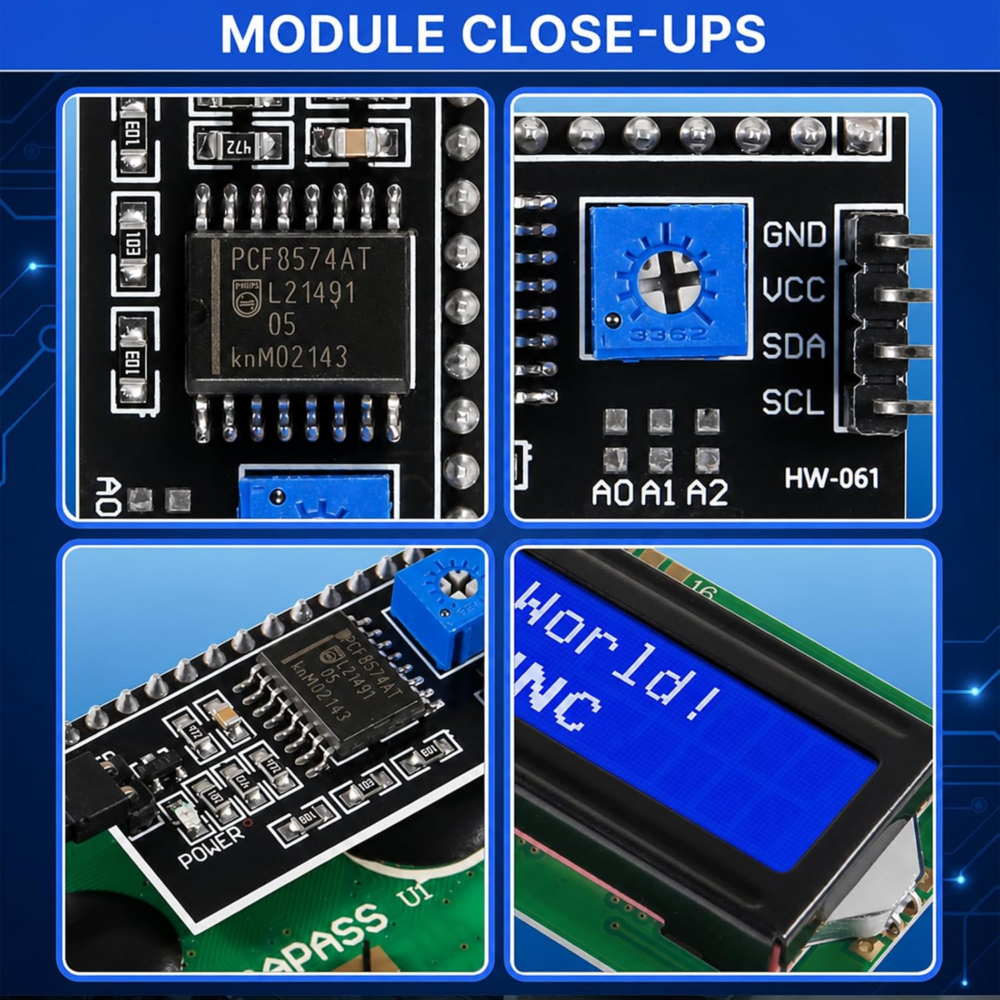

# LCD1602 + I²C backpack (text UI)

Product listing: [Amazon B0FGD3V29S](https://www.amazon.com/dp/B0FGD3V29S) (LCD1602, blue backlight, I²C).

Photo of the backpack / chip (module close-ups):



## What’s on the module

| Item | Observed / stated |
|------|-------------------|
| LCD | **LCD1602** — 16 columns × 2 rows, blue backlight |
| LCD controller | **HD44780**-compatible (standard 16×2 character protocol) |
| I²C expander | **PCF8574AT** (SO16) — Philips / NXP family |
| Chip topside mark (photo) | `PCF8574AT` / `L21491` / `05` / `knM02143` (+ Philips logo) |
| Module silk (photo) | **HW-061**; I²C header **GND · VCC · SDA · SCL** |
| Contrast | Blue trim pot on the backpack |
| Power | **5 V DC** on VCC (module and LCD driven at 5 V) |
| Address select | Three open pads **A0 · A1 · A2** (solder to change address) |

The expander is the **A** variant (**PCF8574A** / **PCF8574AT**), not the non‑A **PCF8574** / **PCF8574T**. The fixed address prefix differs (see below). Earlier listing/review text that says only “PCF8574T” should be treated as approximate; this unit’s marking is **PCF8574AT**.

## Manuals / datasheets

| Document | Use | Link |
|----------|-----|------|
| **NXP PCF8574 / PCF8574A product data sheet** (Rev. 5, 2013) | Authoritative I²C slave address maps, electrical limits, timing, register model | [PCF8574_PCF8574A.pdf](https://www.nxp.com/docs/en/data-sheet/PCF8574_PCF8574A.pdf) |
| HD44780 (Hitachi or clone) | Character LCD command set (4-bit mode used via backpack) | Search “HD44780 datasheet”; many clones match the command set |
| Module “manual” | These Amazon packs rarely ship a real PDF; the backpack is a de-facto **HW-061**-style PCF8574 + HD44780 wiring. Use the NXP datasheet + an I²C scan + a known LiquidCrystal_I2C / ESP-IDF HD44780 example for pin bit mapping | — |

No separate official Solarc/Amazon module PDF is assumed; treat **NXP + bus scan** as the source of truth for bus parameters.

## I²C parameters (from NXP PCF8574/74A)

| Parameter | Value |
|-----------|--------|
| Bus | I²C (SDA, SCL), open-drain with external pull-ups (board may include them) |
| Mode (datasheet) | **Standard-mode**, **100 kHz** max for this part family |
| Supply (chip) | **2.5 V – 6 V** (module intended for **5 V**) |
| Role | Remote **8-bit** quasi-bidirectional I/O expander (single data byte = P7…P0) |
| Address pins | **A2, A1, A0** — must be held HIGH or LOW externally (no internal pull-ups on A*) |
| Variants | **PCF8574** and **PCF8574A** share the same pinout/behavior; only the **fixed upper address bits** differ |

### 7-bit slave address (PCF8574A / PCF8574AT)

Fixed prefix for the **A** variant: bits `A6…A3` = `0111` → base range **0x38 – 0x3F**.

| A2 | A1 | A0 | 7-bit address |
|----|----|----|---------------|
| 0 | 0 | 0 | **0x38** |
| 0 | 0 | 1 | 0x39 |
| 0 | 1 | 0 | 0x3A |
| 0 | 1 | 1 | 0x3B |
| 1 | 0 | 0 | 0x3C |
| 1 | 0 | 1 | 0x3D |
| 1 | 1 | 0 | 0x3E |
| 1 | 1 | 1 | **0x3F** |

Non‑A **PCF8574** / **PCF8574T** uses prefix `0100` → **0x20 – 0x27** (all HIGH → **0x27**). Do not mix the tables.

### As-shipped jumpers (this photo)

- **A0, A1, A2 pads are open** (no solder bridges).
- On common **HW-061**-style boards, open pads usually leave the address pins in the **HIGH** state (or equivalent), so many **PCF8574AT** modules appear at **0x3F**. That is **not guaranteed** until verified: the datasheet requires A* to be tied, and PCB pull-up/pull-down layout varies by clone.
- **Bring-up step:** run an I²C address scan on the ESP32 bus and record the responding address here once confirmed.

Write / read framing (datasheet):

```text
Write:  START → 7-bit addr + W → ACK → data byte (P7…P0) → ACK → … → STOP
Read:   START → 7-bit addr + R → ACK → data byte → … → STOP
```

There is effectively one 8-bit port register; LCD libraries encode RS/RW/E/backlight + nibble data onto those port bits (bit mapping is a module convention, not part of the PCF8574 datasheet).

## Host wiring (to ESP32)

| Module pin | Meaning | Notes |
|------------|---------|--------|
| GND | Ground | Common with ESP32 GND |
| VCC | +5 V | From the USB 5 V supply plan |
| SDA | I²C data | Shared bus; level: 5 V module on 3.3 V ESP32 may need care (many boards tolerate 3.3 V I²C into 5 V PCF8574; prefer proper level shift if unsure) |
| SCL | I²C clock | Same |

Shared bus devices (keypad, 7-segment, this LCD) must use **distinct** 7-bit addresses. Use A0–A2 solder pads if two expanders would collide.

## Firmware notes

1. Scan bus → confirm address (expect **0x3F** class for PCF8574AT with open pads; accept **0x38–0x3F**).
2. Use an HD44780 driver that talks through a **PCF8574** backpack (4-bit mode).
3. Keep I²C at **≤ 100 kHz** unless testing shows a given chip accepts Fast-mode (datasheet rates this family as Standard-mode 100 kHz).
4. Contrast pot: adjust if text is washed out or solid blocks.

## Open questions

- [ ] Confirmed 7-bit address on *this* board after ESP32 scan
- [ ] Exact P0–P7 → RS / RW / E / backlight / D4–D7 mapping for the library in use (measure or match a known HW-061 map)
- [ ] Whether onboard pull-ups alone are enough with multiple I²C modules
