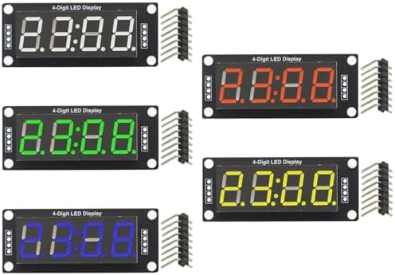
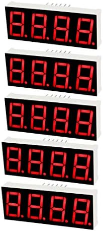

# 4-digit display (clock / countdown)

Two product options were considered. **Preferred for this project is the TM1637 clock module** (central colon, two control pins). The alternate is a **bare** common-anode tube (needs its own driver).

## Preferred: TM1637 clock module

Product: [Amazon B0F8PWZK71](https://www.amazon.com/dp/B0F8PWZK71) — GODIYMODULES 5-pack **TM1637** 4-digit 0.56″ clock displays (blue / red / green / yellow / white).

### Important: not I²C

Earlier notes called this an “I²C clock” module because of the clock-style layout. The listing and driver IC are **TM1637**, which uses a **proprietary 2-wire serial** bus:

| Pin | Role |
|-----|------|
| **CLK** | Clock (not I²C SCL) |
| **DIO** | Data I/O (not I²C SDA) |
| **VCC** | Supply (module described as **5 V** interface) |
| **GND** | Ground |

It does **not** sit on the shared I²C bus with the LCD and keypad. It needs **two dedicated GPIOs**.

### Specs (from listing)

| Item | Detail |
|------|--------|
| Driver IC | **TM1637** |
| Digits | 4 × 7-segment, **0.56″**, common **anode** |
| Layout | Clock / time style with **colon** between digit pairs (HH:MM style) |
| Decimal points | Listing: **“Each decimal place is invalid and cannot be displayed”** — use colon for time; for therapy countdown prefer **MM:SS** or whole seconds without DP |
| Colors in pack | Blue, red, green, yellow, white (one each) |
| Control level | **5 V** (listing) |
| Pins | Often **unsoldered** headers — solder before use |
| MCU load | Two signal lines only |

### Project use

| Mode | Display idea |
|------|----------------|
| Idle | Wall clock **HH:MM** (colon blink optional) |
| Therapy | Exposure remaining **MM:SS** or countdown seconds |

Timebase can come from ESP32 (SNTP over Wi‑Fi later, or RTC / free-running clock for v1).

### Wiring (provisional)

| Module | ESP32 suggestion | Notes |
|--------|------------------|--------|
| CLK | **GPIO18** or **GPIO19** | Any free GPIO; avoid strapping/flash pins |
| DIO | **GPIO23** or **GPIO5** | Same |
| VCC | 5 V (USB rail) | Match listing; check 3.3 V logic tolerance if driving from ESP32 3.3 V GPIO (often works; use level shift if flaky) |
| GND | GND | |

### Firmware

- Use a **TM1637** driver (ESP-IDF component or port of common Arduino `TM1637Display` logic).
- Brightness is controllable via TM1637 commands.
- Datasheet / app notes: search **“TM1637 datasheet”** (Titan Micro; many community PDFs). Protocol is bit-banged CLK/DIO, not standard I²C ACK framing.

### Manuals

| Doc | Notes |
|-----|--------|
| TM1637 datasheet | Titan Micro Electronics — search vendor PDF |
| Product | https://www.amazon.com/dp/B0F8PWZK71 |

## Alternate: bare 4-digit tube (decimal points)

Product: [Amazon B07GTRQYMV](https://www.amazon.com/dp/B07GTRQYMV) — **uxcell** 4-bit 7-segment, model **5641BH**, **common anode**, red, **12 pins**, pack of 5.

| Item | Detail |
|------|--------|
| Type | **Bare LED digital tube** — **no** onboard driver |
| Digits | 4 × 7-segment + **decimal points** (per digit) |
| Height | 0.55″ digits; panel ~50.3 × 19 mm |
| Electrical | ~2 V forward, **20 mA** max continuous (listing); prefer constant-current drive |
| Common anode pins | Listing: pins **12, 9, 8, 6** are common anodes |
| Drive needs | Multiplex or use a driver (e.g. **MAX7219**, **HT16K33**, shift registers + transistors). **Do not** hang segments directly on ESP32 GPIO without resistors / proper drive |

Use this only if decimal points or a different driver topology is required. For clock + countdown with minimal pins, **TM1637 is the better fit**.

## Architecture note (bus map)

| Device | Bus | Address / pins |
|--------|-----|----------------|
| LCD1602 backpack | I²C | PCF8574AT, often **0x3F** — [lcd1602-i2c.md](lcd1602-i2c.md) |
| Keypad adapter | I²C | PCF8574, set ≠ LCD — [keypad-i2c.md](keypad-i2c.md) |
| **TM1637 7-seg** | **CLK + DIO** (not I²C) | Two GPIOs |
| SSR / piezo | GPIO | [peripherals.md](peripherals.md) |
