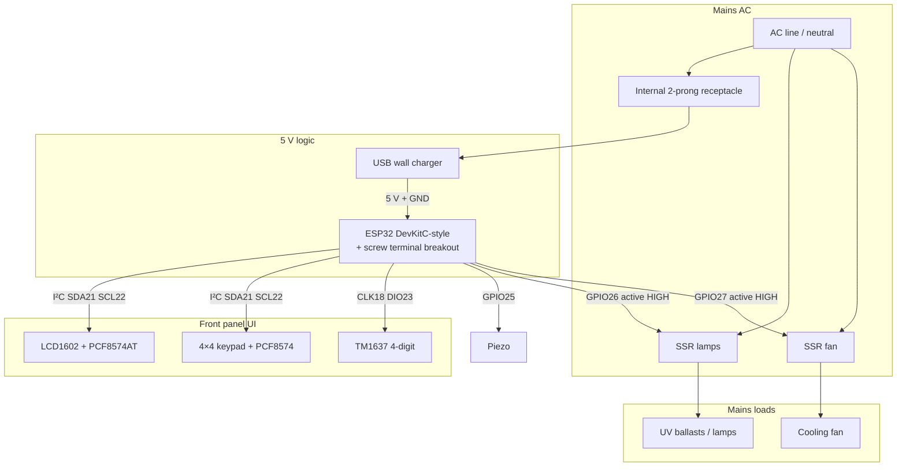

# System wiring diagram

Reference map for the phototherapy controller harness. Pin numbers are
**locked for this bench** unless a change is recorded in the changelog at
the bottom. Product photos and full header silk: [esp32-board.md](esp32-board.md).
Per-module notes: [peripherals.md](peripherals.md), [lcd1602-i2c.md](lcd1602-i2c.md),
[keypad-i2c.md](keypad-i2c.md), [seven-segment-display.md](seven-segment-display.md),
[front-panel.md](front-panel.md).

## Safety (read first)

- **Two power domains:** 5 V logic (USB charger) and **mains AC** (lamps + fan via SSRs). Never share return paths carelessly; keep SSR load wiring away from Dupont UI harness.
- **SSR control defaults LOW / off** at boot, reset, and crash. Lamps must not stay on across reboot.
- **Fan can lag lamps off** in firmware (rundown), but both SSRs still fail **off** on reset.
- GPIO experiments near live mains are not “safe” because the GPIO is low voltage — the load side is still mains.

## Locked pin budget

| Function | ESP32 pin | Interface | Notes |
|----------|-----------|-----------|--------|
| I²C SDA | **GPIO21** | LCD + keypad | Shared bus |
| I²C SCL | **GPIO22** | LCD + keypad | Shared bus |
| LCD backpack | (I²C) | **0x27** (this unit) | 5 V VCC; GND, VCC, SDA, SCL |
| Keypad PCF8574 | (I²C) | **0x20** (this unit) | 3.3–5 V; SDA, SCL, VCC, GND |
| TM1637 CLK | **GPIO18** | Bit-bang | Not I²C |
| TM1637 DIO | **GPIO23** | Bit-bang | Not I²C |
| **SSR lamps** | **GPIO26** | Active HIGH | Ballasts / UV lamps; fail-off |
| **SSR fan** | **GPIO27** | Active HIGH | Cooling fan; fail-off; may run after lamps |
| Piezo | **GPIO25** | LEDC / GPIO | End beep, UI feedback |
| Status LED (optional) | **GPIO2** | Onboard / external | Prefer mirror **lamps** only, not fan |
| USB serial | GPIO1 TX / GPIO3 RX | CP2102 | Programming / monitor — do not reuse |

### Free / reserved for later

Good general outputs still free: **GPIO4, 5, 13, 14, 15, 16, 17, 19, 32, 33** (watch strapping on 0/2/12/15). Avoid **6–11** (flash). **34–39** input-only.

## ESP32 module headers (left / right, top → bottom)

Orientation matches the board and [esp32-board.md](esp32-board.md): **USB-C at the top**. Left = Espressif **J2** (pins **1–19**); right = **J3** (pins **20–38**, same top→bottom order). Silk is the board label; **This build** is the project assignment; **Color** is the bench Dupont harness (— = unassigned / not used).

### Harness colors (locked for this build)

| Color | Use |
|-------|-----|
| **Black** | GND |
| **Red** | +5 V |
| **White** | SSR lamps (GPIO26) |
| **Grey** | SSR fan (GPIO27) |
| **Blue** | TM1637 DIO (GPIO23) |
| **Green** | TM1637 CLK (GPIO18) |

| # L | Color | Left this build | Left silk |  | Right silk | Right this build | Color | # R |
|----:|-------|-----------------|-----------|:-:|------------|------------------|-------|----:|
| 1 | — | Logic 3.3 V rail (optional out) | **3V3** | … | **GND** | Common ground | **Black** | 20 |
| 2 | — | Reset (button / CHIP_PU) | **EN** | … | **23** | **TM1637 DIO** | **Blue** | 21 |
| 3 | — | — (input only) | **VP** (GPIO36) | … | **22** | **I²C SCL** (LCD + keypad) | — | 22 |
| 4 | — | — (input only) | **VN** (GPIO39) | … | **TX** (GPIO1) | USB serial to PC — leave free | — | 23 |
| 5 | — | — (input only) | **34** | … | **RX** (GPIO3) | USB serial from PC — leave free | — | 24 |
| 6 | — | — (input only) | **35** | … | **21** | **I²C SDA** (LCD + keypad) | — | 25 |
| 7 | — | — | **32** | … | **GND** | Common ground | **Black** | 26 |
| 8 | — | — | **33** | … | **19** | — | — | 27 |
| 9 | — | **Piezo** | **25** | … | **18** | **TM1637 CLK** | **Green** | 28 |
| 10 | **White** | **SSR lamps** (active HIGH) | **26** | … | **5** | — | — | 29 |
| 11 | **Grey** | **SSR fan** (active HIGH) | **27** | … | **17** | — | — | 30 |
| 12 | — | — | **14** | … | **16** | — | — | 31 |
| 13 | — | — (strapping; avoid if possible) | **12** | … | **4** | — | — | 32 |
| 14 | **Black** | Common ground | **GND** | … | **0** | BOOT strapping — leave free | — | 33 |
| 15 | — | — | **13** | … | **2** | **Status LED** (optional; lamps only) | — | 34 |
| 16 | — | Flash — do not use | **D2** (GPIO9) | … | **15** | — (strapping) | — | 35 |
| 17 | — | Flash — do not use | **D3** (GPIO10) | … | **D1** (GPIO8) | Flash — do not use | — | 36 |
| 18 | — | Flash — do not use | **CMD** (GPIO11) | … | **D0** (GPIO7) | Flash — do not use | — | 37 |
| 19 | **Red** | 5 V from USB / charger (logic supply) | **5V** | … | **CLK** (GPIO6) | Flash — do not use | — | 38 |

**In use (summary):** I²C on **21/22**, TM1637 on **18/23** (green/blue), piezo **25**, SSR lamps **26** (white), SSR fan **27** (grey), optional LED **2**, power **5V** red / **GND** black.

## Block diagram



## Power and domains (ASCII)

```text
                    ┌─────────────────────────────────────────┐
  Mains AC ─────────┤  Internal 2-prong receptacle            │
    │               │       └── USB charger ── 5 V ──► ESP32  │
    │               │                          GND ──► ESP32  │
    │               └─────────────────────────────────────────┘
    │
    ├──── SSR lamps (GPIO26) ──── UV ballasts / lamps
    │
    └──── SSR fan  (GPIO27) ──── cooling fan

  ESP32 ── I²C (21/22) ──┬── LCD backpack (0x27)
                         └── Keypad adapter (0x20)
  ESP32 ── TM1637 CLK18 / DIO23
  ESP32 ── Piezo GPIO25
```

## Module connectors (logic side)

All UI modules stay on **0.1″ headers + female Dupont** for v1 ([front-panel.md](front-panel.md)).

| Module | Pins (typical silk) | To ESP / bus |
|--------|---------------------|--------------|
| LCD backpack | GND · VCC · SDA · SCL | GND, **5 V**, GPIO21, GPIO22 |
| Keypad I²C | SDA · SCL · VCC · GND (order may vary) | GPIO21, GPIO22, 3.3/5 V, GND |
| TM1637 | GND · VCC · DIO · CLK (confirm silk) | GND, 5 V or 3.3 V per module, GPIO23, GPIO18 |
| Piezo | + / − (or signal / GND) | GPIO25 (+ series R), GND |
| SSR lamps control | **+** / **−** (DC input) | GPIO26 → **+**, GND → **−** |
| SSR fan control | **+** / **−** | GPIO27 → **+**, GND → **−** |

Bench harness colors: see table above (GND black, +5 V red, SSR lamps white, SSR fan grey, TM1637 DIO blue / CLK green). Pin numbers win if a lead is re-colored.

## SSR lamps vs SSR fan

The Amazon pack is **two SSR-25DA** units ([B0CBS8817G](https://www.amazon.com/dp/B0CBS8817G)) — use one for lamps, one for fan.

| Channel | GPIO | Load | Session intent |
|---------|------|------|----------------|
| Lamps | **26** | Ballasts / UV | On only during active therapy exposure |
| Fan | **27** | Cooling fan | On with lamps (or shortly before); **stay on a few seconds after lamps off** |

### Fail-safe rules

1. Boot / panic / brown-out: **both** SSR GPIOs driven **LOW** before other init.
2. Firmware may implement fan rundown after lamp-off; a reset still cuts both.
3. Status LED on GPIO2 (if used) should track **lamps**, not fan, so “UV on” is unambiguous.
4. Do not parallel both loads on one SSR if you need independent rundown.

### Firmware note

As of this doc, `session_timer` still drives a **single** `SSR_GPIO` (26) for “lamp path.” Fan on **27** is the **wiring / pin lock**; product logic for rundown is a follow-up change in firmware.

## Mains load side (conceptual)

```text
  Line ──┬── SSR-lamps load terminal 1
         │         load terminal 2 ──► ballasts / lamps ──► Neutral
         │
         └── SSR-fan  load terminal 1
                   load terminal 2 ──► fan ──► Neutral
```

Confirm SSR terminal silk and ballast wiring against the stock unit before energizing. Heat-sink SSRs for continuous current; size conductors for ballast inrush.

## Cross-links

| Topic | Doc |
|-------|-----|
| ESP32 header map | [esp32-board.md](esp32-board.md) |
| SSR / piezo detail | [peripherals.md](peripherals.md) |
| Front plate harness | [front-panel.md](front-panel.md) |
| LAN / Rails discovery | [device-discovery.md](device-discovery.md) |

## Changelog

| Date | Change |
|------|--------|
| 2026-07-23 | Initial wiring diagram: pin budget, mermaid + ASCII, dual SSR (lamps 26 / fan 27) |
| 2026-07-23 | Left/right ESP header table with per-pin project assignments |
| 2026-07-24 | Harness colors + right-side pin #s 20–38; column order use/silk/…/silk/use |
